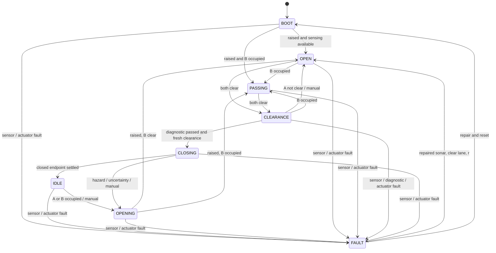

# Smart Parking Barrier

An Arduino Uno parking-barrier model that detects a vehicle, opens the arm, observes the crossing and closes after both sensing zones are clear. If a vehicle stops underneath it, the arm stays open. An obstruction during descent requests reopening.

**Status:** firmware compiled for Uno; 46 software scenarios pass. Physical assembly, calibration and acceptance tests are **not yet verified**. [Verification details](docs/validation.md)

## Demo

Video and prototype photos will be added after the build. The planned 90-second demonstration shows normal passage, an intentional stop and obstruction-triggered reopening. [Shot list](docs/demo.md) · [Evidence checklist](docs/evidence.md)

## Why this design

The crossing beam confirms occupation and trailing-edge clearance. Endpoint switches check that the arm reached its target. These address failures that an approach sensor followed by a fixed delay cannot detect.

## Architecture

```text
HC-SR04 approach A ─┐                 ┌─ MG90S + light arm
IR crossing beam B ├─ Arduino Uno ────┼─ red/green LEDs + optional piezo
Endpoint switches ┤  state machine  └─ Serial diagnostics
Hold-open button ─┘
```

**Why two zones?** A detects the vehicle before the arm. B sits just beyond the arm's swept region and detects body interruption followed by trailing-edge clearance. An open-duration timer alone cannot distinguish a stopped vehicle from one that has passed. [Geometry and assumptions](docs/geometry.md)

## Key behaviour

Approach → confirmed opening → crossing/occupied hold → fresh vacancy check → gradual closing. A retreat also recovers normally. A long stop produces an advisory; a new hazard during closing requests immediate reopening.

## State machine



[Full state table and fault policy](docs/architecture.md)

## Hardware

Uno R3, HC-SR04, through-beam IR pair, MG90S positional servo, two lever microswitches, two LEDs, hold-open button, optional passive piezo, NPN driver, resistors, capacitors and a regulated 5 V / 2 A servo supply. An SG90 is suitable for the same light model arm after calibration. [BOM and substitutions](hardware/bom.md)

## Wiring

| Uno | Connection |
|---|---|
| D4 / D2 | HC-SR04 TRIG / ECHO; 10 kΩ Echo pull-down |
| D3 | IR receiver OUT; 10 kΩ pull-up to Uno 5 V |
| D5 | 1 kΩ to NPN base; emitter driver with 10 kΩ base pull-down |
| D9 | Servo signal; 10 kΩ pull-down |
| D6 / D7 | Red / green LED, each through 330 Ω |
| D8 | Passive piezo through 330 Ω |
| A0 / A1 | Open / closed switch NO; COM to GND |
| A2 | Hold-open button to GND |

Use USB for Uno logic and a separate regulated 5 V supply for the servo. **Join grounds; keep the two +5 V rails separate.** The receiver must read LOW when illuminated and HIGH when blocked. [Complete circuit and power wiring](docs/wiring.md)

## Build / setup

Open [smart_parking_barrier.ino](firmware/smart_parking_barrier/smart_parking_barrier.ino). Use **Arduino AVR Boards 1.8.6**, **Servo 1.3.0**, board **Arduino Uno**, and Serial **115200 baud**.

```sh
arduino-cli core update-index --config-file arduino-cli.yaml
arduino-cli core install arduino:avr@1.8.6 --config-file arduino-cli.yaml
arduino-cli lib install Servo@1.3.0 --config-file arduino-cli.yaml
arduino-cli compile --config-file arduino-cli.yaml --fqbn arduino:avr:uno firmware/smart_parking_barrier
```

Select the actual board port in Arduino IDE to upload. Start without the arm attached. Calibrate `OPEN_ANGLE`, `CLOSED_ANGLE`, the switches and the sonar thresholds before running a vehicle.

## Testing evidence

- [Software results](docs/validation.md): 46 scenarios, including five failures reproduced in the original sketch and fixed.
- [Physical acceptance suite](docs/testing.md): 14 required tests; [results](docs/test-results.csv) are still NOT RUN.
- [Engineering review](docs/review.md): feature decisions, failure traces and limitations.

Run the production sketch with simulated IO using a C++11 compiler and Python:

```sh
mkdir -p build
g++ -std=c++11 -Wall -Wextra -Werror -Itests/stubs tests/firmware_tests.cpp -o build/firmware-tests
python3 tests/run_tests.py ./build/firmware-tests
```

The GitHub workflow repeats host tests and the Uno build after publication. Software tests do not establish real sensor coverage, supply stability or mechanical response.

## Safety behaviour

- Three consecutive sonar readings and hysteresis reject chatter; a single uncertain or non-clear reading vetoes descent.
- Closing requires an emitter-off check **while raised**, restored beam confirmation and a fresh **1.2 s both-clear interval**. The emitter stays on throughout descent.
- Closing advances 1° every 20 ms; a hazard requests OPEN immediately. Endpoint switches, not commanded angle, verify movement.
- A 30 s open wait produces an advisory, not a fault. Normal vacancy recovers automatically.
- Sensor failure requests OPEN; movement failure stops pulses and latches. **Stopping pulses does not isolate servo power or guarantee the arm's position.**

Green means confirmed open; steady red means closed/moving; flashing red means fault. Serial prints state names plus numeric telemetry. This is a supervised model for an opaque guided body ≥20 cm long at ≤3 cm/s, not a safety-rated road barrier. [Operating limits and diagnostics](docs/architecture.md)

## Repository structure

```text
firmware/smart_parking_barrier/   maintained Uno sketch
hardware/bom.md                 parts and substitutions
docs/                           circuit, build, tests and evidence plan
tests/                          production-sketch host tests and IO stubs
tools/                          consistency check and source packaging
.github/workflows/verify.yml     host tests and Uno compile
```

## Limitations

The hardware is unverified. Single-channel sensing can miss objects outside the validated model geometry or a persistent false-clear fault arising after the diagnostic. A jam or power loss cannot guarantee a raised arm. No exact direction/counting or safety certification is claimed.

## Future improvements

First measure the physical margins and improve mounts or wiring where the acceptance results require it. Redundant sensing and mechanical fail-open actuation would belong to a different, full-size design.

## Build and submission

[Build in stages](docs/construction.md) → [run acceptance tests](docs/testing.md) → [capture evidence](docs/evidence.md) → [publish](docs/publishing.md) → [final checklist](docs/checklist.md).

[Troubleshooting](docs/debugging.md) · [Interview questions](docs/interview.md) · [Submission wording](docs/submission.md). MIT licensed; see [LICENSE](LICENSE).
