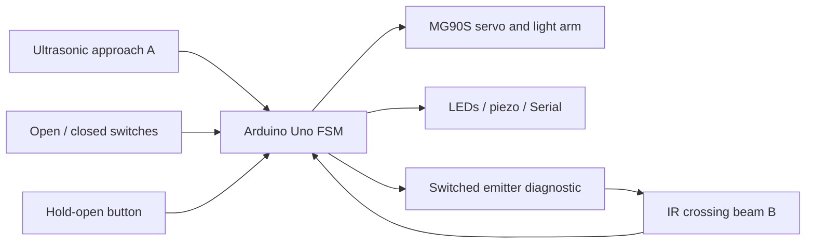
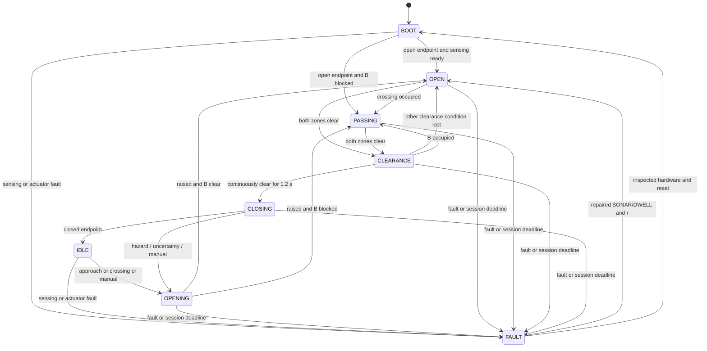

# Smart Parking Barrier

A two-zone tabletop parking barrier for **Task 3 — Sensors & Embedded Systems (Advanced)**. An Arduino Uno detects an approaching model vehicle, raises the arm, monitors the crossing and closes after verified clearance.

**Status:** design and firmware are implemented. The Uno build and software scenarios are checked in [the validation report](docs/validation.md). Physical assembly, calibration, photographs and demonstration tests are still pending. This repository does not claim hardware results that have not been recorded.

## Problem statement

> Build a smart parking barrier. The system should detect an approaching vehicle, open the barrier, detect when it has passed, and close the barrier.

The main design decision is to check clearance at the arm itself. A fixed open-time delay cannot tell whether a vehicle is still underneath it.

## Demo

**Video: pending physical build and recording.** The [85-second shot list](docs/demo.md) covers normal passage, a stopped vehicle under the arm and an abandoned approach. Real prototype photographs will go in [docs/images](docs/images/README.md).

## Key features

- HC-SR04 approach zone and an IR through-beam crossing zone.
- Enum-based finite-state machine, with distinct opening, passing, clearance and closing states.
- Three consecutive sonar samples and separate occupied/clear thresholds.
- Asynchronous Echo capture with timeout; no `pulseIn()` or long `delay()` calls.
- Continuous-clear interval, plus hazard monitoring and reopen requests during closure.
- Open and closed endpoint switches for actual movement feedback.
- Periodic emitter-off test to detect a beam input stuck LOW/clear.
- Manual hold-open, red/green LEDs, closing chirps and fault indication.
- Latched sensing, dwell and actuator faults with controlled recovery.
- Compile checks and host tests that exercise the actual firmware source.

## Architecture



The Uno R3 matches the 5 V sonar and has enough pins and memory for this task. Wi-Fi and a display would add setup without improving crossing detection. The IR beam replaces a second ultrasonic sensor, avoiding sonar cross-talk and directly detecting vehicle-body interruption. See [architecture and tradeoffs](docs/architecture.md).

## Working principle

1. On boot, command OPEN, verify its endpoint and establish sensor readings.
2. Once both zones remain clear for 1.2 seconds, close and verify IDLE.
3. Three occupied approach readings, crossing-first activity or manual hold requests opening.
4. The arm remains open while the vehicle occupies either zone. The crossing beam observes arrival of the front and clearance of the trailing edge.
5. Both zones must be confirmed clear for a new 1.2-second interval before closing starts.
6. New occupancy, uncertain sonar or manual hold during closing requests reopening.
7. A 30-second automatic session timeout raises an open fault; it never forces closure.

An abandoned approach can close after both zones become empty without claiming a completed passage. Reversals and repeated triggers stay within the same session until the lane is clear. Closely following vehicles can share one open interval; exact vehicle counting is not implemented.

## State machine



The [full state table](docs/architecture.md#state-machine) defines entry actions, guards and deadlines.

## Hardware

| Part | Quantity |
|---|---:|
| Arduino Uno R3 / ATmega328P compatible | 1 |
| HC-SR04 | 1 |
| IR emitter/receiver through-beam pair | 1 pair |
| MG90S positional servo (SG90 allowed for a light arm) | 1 |
| Lever endpoint microswitch | 2 |
| Red LED, green LED | 1 each |
| Passive piezo and hold-open button | 1 each |
| NPN emitter driver and resistors | 1 set |
| Regulated external 5 V / 2 A servo supply | 1 |
| Capacitors, wiring, base and foam arm | 1 set |

See the [complete BOM and substitutions](hardware/bom.md). A reflective IR obstacle module is not a drop-in replacement for the crossing beam.

## Wiring

| Uno connection | Destination |
|---|---|
| D4 / D2 | Sonar TRIG / ECHO; 10 kΩ Echo pull-down |
| D3 | IR receiver OUT; 10 kΩ pull-up to Uno 5 V |
| D5 through 1 kΩ | NPN base; 10 kΩ base-to-GND; collector to emitter negative |
| D9 | Servo signal; 10 kΩ pull-down to GND |
| D6 / D7 through 330 Ω | Red / green LED anodes; cathodes to GND |
| D8 through 100 Ω | Passive piezo; other terminal to GND |
| A0 / A1 | Open / closed NO switch contacts; COM to GND |
| A2 | Hold-open NO button to GND |
| USB | Uno logic power and Serial |
| External +5 V / GND | Servo supply; join external GND to Uno GND |

Sonar and receiver VCC use Uno 5 V; their grounds use Uno GND. The current-limited IR emitter module takes Uno 5 V on its positive wire; its negative wire is switched by the NPN collector. The transistor emitter goes to GND.

**Use [the complete pin-to-pin wiring and ASCII circuit](docs/wiring.md) when assembling.** The servo supply positive must stay separate from Uno USB-powered 5 V. Never power a servo from a GPIO. Confirm the purchased beam receiver gives LOW when illuminated and HIGH when blocked/emitter-off. This pin map is for the 5 V Uno R3, not ESP32.

## Software requirements

- Arduino IDE 2.x, or Arduino CLI.
- Arduino AVR Boards **1.8.6**; board **Arduino Uno**, FQBN `arduino:avr:uno`.
- Arduino **Servo 1.3.0** library.
- Serial Monitor at **115200 baud**.
- Optional host verification: Python 3 and a C++11 compiler.

## Installation

1. Download/clone this repository.
2. Open `firmware/smart_parking_barrier/smart_parking_barrier.ino` in Arduino IDE. Keep the matching folder/sketch names.
3. Install the board package and Servo version above. Select Arduino Uno and the actual connected serial port.
4. Keep the arm disconnected while checking wiring, sensor polarity and endpoint calibration.
5. Compile, upload, then open Serial Monitor at 115200.
6. Complete [construction and bring-up](docs/construction.md) before attaching the final arm.

CLI equivalent, from the repository root:

```sh
arduino-cli core update-index
arduino-cli core install arduino:avr@1.8.6
arduino-cli lib install Servo@1.3.0
arduino-cli compile --fqbn arduino:avr:uno --warnings all firmware/smart_parking_barrier
arduino-cli board list
arduino-cli upload --fqbn arduino:avr:uno --port YOUR_PORT firmware/smart_parking_barrier
```

Replace `YOUR_PORT` with the port reported for your board. The optional `arduino-cli.yaml` keeps tool downloads local to `.tools/`; pass `--config-file arduino-cli.yaml` consistently to each command if using it.

## Usage and calibration

- Use the guided 18 cm opaque model at ≤3 cm/s. Wait for green before crossing the arm.
- **Red steady:** closed or moving. **Green:** open endpoint confirmed during OPEN/PASSING/CLEARANCE. **Red flashing:** latched fault.
- Hold the button to request OPEN. Releasing it permits normal clearance checking; it does not command CLOSE.
- `OPEN_ANGLE=95`, `CLOSED_ANGLE=10` are starting values. Calibrate them with the arm removed and then adjust the endpoint cams.
- Default sonar thresholds: occupied ≤160 mm, clear ≥200 mm, valid 20–350 mm. Use a fixed backboard about 240 mm away.
- Record measured empty/occupied ranges before changing thresholds. Do not weaken clearance logic to hide poor placement.

Serial example format: `s=4 f=0 mm=240 v=1 a=0 b=0 o=1 c=0 p=0`. This is a format example, not a captured hardware log.

| Field | Meaning |
|---|---|
| s | State: 0 BOOT, 1 IDLE, 2 OPENING, 3 OPEN, 4 PASSING, 5 CLEARANCE, 6 CLOSING, 7 FAULT |
| f | Fault: 0 NONE, 1 SONAR, 2 BEAM_TEST, 3 DWELL, 4 LIMITS, 5 ACTUATOR |
| mm / v | Last valid distance in mm / latest result valid; stale `mm` alone is not safe evidence |
| a / b | Confirmed approach occupied / last normal beam observation blocked |
| o / c | Debounced open / closed endpoint |
| p | Approach observed, then A clear while B occupied: forward-progress evidence for this session |

No vehicle counter is implemented. `p` can help explain the sequence but is not an exact directional passage count.

## Safety and fault handling

Unknown measurements veto closure. The sonar has a 25 ms asynchronous Echo timeout, three-sample confirmation, 160/200 mm hysteresis and a 300 ms stale deadline. The beam asserts blocked immediately and requires 100 ms clear. A fresh 1.2-second both-clear interval controls normal closing.

Every 250 ms the emitter is switched off for about 3 ms and allowed about 3 ms to settle after switching on. The receiver must read HIGH when the emitter is off; a stuck LOW signal latches a beam-test fault. The last observation is retained during the approximately 6 ms diagnostic interval. Closing cannot start during that interval, but an already-moving arm continues; the resulting latency must be physically validated.

Movement must leave its source switch within 500 ms and reach its destination within 2.5 seconds. Both switches active, a missing reached endpoint, or a travel fault stops servo command pulses and latches the actuator. This does **not** isolate power or guarantee a raised arm.

For SONAR/DWELL faults, repair the cause, make the lane clear, confirm the arm is open, release manual hold and send `r`. Beam-test and actuator/limit faults require physical inspection and controller reset. Remove external servo power before addressing a jam. Power restoration commands OPEN; passive behaviour during power loss is not guaranteed.

This is a supervised tabletop prototype with a light breakaway arm. It is not suitable for controlling full-size vehicles or protecting people. The [safety boundary](docs/architecture.md#safety-boundary-and-residual-risks) explains geometry, failure detection and remaining risks.

## Testing

Run host tests from the repository root:

```sh
mkdir -p build
g++ -std=c++11 -Wall -Wextra -Werror -Itests/stubs tests/firmware_tests.cpp -o build/firmware-tests
python3 tests/run_tests.py ./build/firmware-tests
```

On Windows, use an installed C++ compiler to build `build/firmware-tests.exe` and pass that path to Python. The host test substitutes hardware IO but includes the actual final `.ino`. The GitHub Actions workflow runs host tests and an Uno build; its remote result must be checked after publishing.

- [Validation report](docs/validation.md): actual local software/build results and limitations.
- [25-case physical test matrix](docs/testing.md): required scenarios and pass criteria.
- [Physical results CSV](docs/test-results.csv): all physical rows begin as NOT RUN.
- [Troubleshooting](docs/debugging.md): symptoms, likely causes and fixes.

## Project structure

```text
smart-parking-barrier/
├── README.md
├── LICENSE
├── .gitignore
├── .gitattributes
├── arduino-cli.yaml
├── .github/workflows/verify.yml
├── firmware/smart_parking_barrier/smart_parking_barrier.ino
├── hardware/bom.md
├── docs/
│   ├── architecture.md
│   ├── wiring.md
│   ├── construction.md
│   ├── testing.md
│   ├── test-results.csv
│   ├── validation.md
│   ├── debugging.md
│   ├── demo.md
│   ├── submission.md
│   ├── publishing.md
│   ├── checklist.md
│   ├── complete-build-guide.md
│   └── images/README.md
├── tests/
│   ├── firmware_tests.cpp
│   ├── run_tests.py
│   └── stubs/{Arduino.h,Servo.h}
└── tools/package_project.py
```

## Future improvements

After the physical prototype is validated: redundant clearance sensing, actuator current/position feedback, a mechanically designed fail-open mechanism and direction/counting sensors. A small display or network dashboard can be added later if it supports a real use case. None of these are claimed as current features.

## Publishing and submission

Follow [publishing.md](docs/publishing.md), add the actual demo and recorded results, and use the appropriate [submission paragraph](docs/submission.md). The [final checklist](docs/checklist.md) separates software readiness from a completed physical submission.

## License

MIT; see [LICENSE](LICENSE). Third-party toolchains and libraries retain their own licenses and are not bundled in the source repository.
