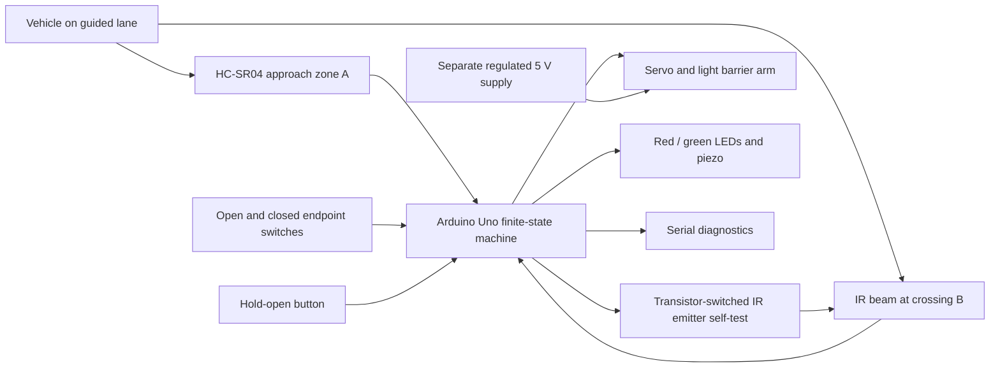
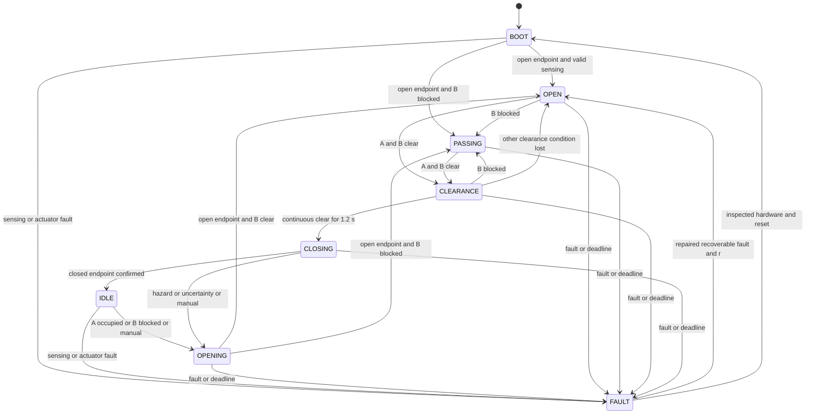

# Architecture and requirements

## Task interpretation

The supplied form asks for a working approach → open → passed → close sequence and a project URL with an explanation. It does not supply a grading rubric. The following judging criteria are engineering inferences: visible completion of the sequence, repeatability, justified hardware choices, readable firmware, handling of stopped vehicles, and credible test evidence.

Approach means confirmed vehicle presence before the barrier, not one noisy echo. Open means the open endpoint is physically reached, not merely that `Servo.write()` ran. Passed means an occupied crossing becomes clear; it is different from a timer expiring. Safe closure requires a known-clear approach zone and crossing for a continuous interval, with monitoring during the downward movement.

Functional requirements:

- Detect a model vehicle before the arm and open automatically.
- Confirm both arm endpoints with physical switches.
- Hold open for occupancy, uncertainty or manual hold.
- Confirm crossing occupancy and subsequent clearance, then close.
- Handle abandoned approaches, reverse movements and successive vehicles without requiring a controller reset.
- Report state, measurements, sensor validity and faults over Serial.

Safety requirements:

- Missing sonar echoes are UNKNOWN, never evidence of clear space.
- A timer may trigger an open fault; it cannot override an occupied zone.
- A new hazard while closing requests opening on the next loop, subject to the bounded beam diagnostic interval and physical actuator response.
- Boot requests opening, then establishes sensing and checks clearance before closing.
- Actuator faults latch, stop command pulses and prohibit automatic reattachment.

## Selected architecture

Arduino Uno R3 + one HC-SR04 approach sensor + one through-beam IR crossing sensor + MG90S positional servo + two lever microswitches. Red/green LEDs, a passive piezo and a hold-open button make operation visible. A transistor switches the IR emitter for a short diagnostic test.

This is a two-zone design: A is approach; B is the crossing/clearance plane immediately beyond the arm. There is no separate distant exit sensor. The crossing beam observes the vehicle front entering and the trailing edge leaving. A fixed sonar backboard makes the empty lane produce a valid echo.

| Option | Tradeoff | Decision |
|---|---|---|
| One ultrasonic sensor and a delay | Cannot distinguish waiting, passing and reversing; cannot prove clearance | Reject |
| Two HC-SR04 sensors | Kit friendly, but echoes need scheduling and two distant zones can leave a blind spot | Viable learning fallback; not supplied final build |
| HC-SR04 + reflective IR obstacle module | Cheap; reflection depends on vehicle surface and background | Avoid for final crossing clearance |
| HC-SR04 + through-beam IR | Different sensing mechanisms, direct body interruption, no ultrasonic cross-talk | Select |
| Uno R3 | 5 V sensor compatibility, two external interrupts, sufficient memory, no radio setup | Select |
| ESP32 | Useful for networking; needs 5 V Echo level shifting and different firmware/pins | No meaningful advantage for this task |

## Exact algorithm

1. Start with red indication and command the arm open. Supervise departure and arrival switches.
2. Acquire asynchronous sonar readings every 65 ms. Require three consecutive occupied/clear readings; retain occupancy in the hysteresis band.
3. Read the crossing beam continuously. Assert blocked immediately, require 100 ms clear, and test emitter-off response every 250 ms.
4. After boot, once the arm is open and sensing is available, wait until both zones are clear for 1.2 s; then close and verify the closed endpoint.
5. From IDLE, confirmed approach, crossing-first activity or manual hold starts opening.
6. Track approach activity and crossing occupation during opening and while open. A clear A while B remains occupied after approach activity records forward-progress evidence (`p=1`). This is diagnostic evidence, not a vehicle count or certified direction measurement.
7. Stay open while A or B is occupied, a reading is uncertain, or the manual button is pressed.
8. Once A and B are confirmed clear, start a fresh 1.2 s clearance interval. Any hazard resets it. At completion, start closing only outside an IR diagnostic blanking interval.
9. During closing, a single invalid sonar result, non-clear latest sonar reading, blocked beam or manual assertion requests reopening. Revalidate clearance afterwards.
10. After 30 s without completing an automatic session, latch an open dwell fault. Sensor faults request open. Actuator faults stop pulses and require inspection and reset.

## State machine

Global priority: actuator contradiction/jam → stop fault; persistent sensing fault → open fault; session deadline → open fault. These checks apply before ordinary transitions. Manual assertion is immediate; its release goes through normal clearance verification.

| State | Entry and actions | Sensor condition / transition | Timeout or fault |
|---|---|---|---|
| BOOT | Reset; command OPEN; red | Open endpoint confirmed + healthy A + beam test performed → OPEN or PASSING | No valid A by 2 s → SONAR; actuator limit checks always active |
| IDLE | Closed endpoint verified; red | Confirmed A occupied, B blocked or manual → OPENING | Persistent sensing fault → FAULT/open |
| OPENING | Command OPEN; red | Open endpoint confirmed → PASSING if B blocked, otherwise OPEN | Source endpoint must release within 500 ms; target within 2.5 s |
| OPEN | Arm confirmed open; green | B blocked → PASSING; both zones clear → CLEARANCE | 30 s automatic session deadline → DWELL/open |
| PASSING | B occupied now or earlier; hold open | Both zones clear → CLEARANCE; otherwise stay | Same dwell deadline; no forced closure |
| CLEARANCE | Keep open; start fresh continuous-clear timer | Hazard → PASSING/OPEN; clear for 1.2 s and beam test inactive → CLOSING | Same dwell deadline |
| CLOSING | Command CLOSE; red + warning chirps | Any clear-condition loss → OPENING; closed endpoint → IDLE | 500 ms departure / 2.5 s arrival; timeout → stopped actuator fault |
| FAULT | Red flashes; fault chirps | Repaired SONAR/DWELL: `r` accepted only when open, both zones clear and manual released | BEAM_TEST and actuator/limit faults require physical inspection and reset; no automatic retry |

## Safety boundary and residual risks

This is a supervised tabletop prototype, not a road-access safety product. Its software prevents planned closure while the observed zones are occupied or uncertain. That is conditional on correct wiring, validated sensing coverage, vehicle geometry and actuator response. It cannot guarantee that an arbitrary object is never struck.

Use an opaque model body at least 18 cm long, about 7 cm wide and 5 cm high, guided straight through the lane at no more than 3 cm/s. The two sensing planes are 13 cm apart. The body must continuously intersect both sensing heights; a gap between the sensors must not hide a permitted vehicle. The IR beam is 1 cm downstream of the arm centre, beyond its swept thickness. Evaluate and mark the real swept envelope before gluing mounts.

The IR test briefly removes the beam for about 6 ms every 250 ms. The last observation is retained during that interval; closure cannot start during it. An object arriving during a test is seen after the emitter settles. At 3 cm/s, 6 ms is 0.18 mm of travel; loop latency and mechanical reversal time must also be measured. Obstruction assertion is unfiltered; clearance is filtered. Tests detect a signal permanently shorted LOW, but cannot prove optical alignment, immunity to all ambient interference or redundant fail-safe operation.

An open beam wire or failed emitter reads blocked with the specified receiver and pull-up. That causes an open hold and eventually a dwell fault. A receiver with the opposite polarity is NOT a drop-in replacement. Some vendor tutorial text is contradictory; measure illuminated, blocked and emitter-off states before attaching the arm.

Endpoint switches prove two positions, not torque, intermediate position or obstacle contact. A jam may leave the arm partly lowered. `detach()` stops command pulses; it is not power isolation and servo behaviour without pulses must be checked. Remove external servo power for a jam. Use a very light breakaway arm and supervise operation. Power loss itself does not guarantee the arm stays raised: boot-open is a restart policy, not a mechanical fail-open guarantee.

## Optional features decision

| Feature | Decision |
|---|---|
| Red/green LEDs | Implemented; green only after open endpoint confirmed |
| Passive piezo | Implemented; closing warning and latched-fault indication |
| Hold-open button | Implemented; cannot force-close or override a jam |
| Endpoint switches | Implemented; replace guessed motion completion with feedback |
| Emitter self-test | Implemented; catches a dangerous static clear signal |
| OLED / LCD | Omit; Serial plus LEDs already expose the required states |
| Vehicle counter / EEPROM count | Omit; reversing and close tailgating make exact counting ambiguous |
| Emergency stop | Software button is not an E-stop; external servo supply switch is only a manual isolator |
| ESP32 web dashboard / Wi-Fi | Future extension after physical verification; not needed for evaluation |
| AI / ML | No benefit for this controlled sensing problem |

## Source references

- [Arduino Uno R3 specifications](https://store.arduino.cc/products/arduino-uno-rev3): 5 V ATmega328P platform and D2/D3 interrupt capability.
- [HC-SR04 datasheet hosted by SparkFun](https://cdn.sparkfun.com/datasheets/Sensors/Proximity/HCSR04.pdf): trigger pulse, Echo conversion and measurement spacing. Its small-target performance must be checked on the actual model.
- [Adafruit receiver product](https://www.adafruit.com/product/2168): open-collector receiver requires a pull-up.
- [Manufacturer support clarification](https://forums.adafruit.com/viewtopic.php?p=731270): illuminated phototransistor LOW, interrupted beam HIGH. Verify the purchased part.
- [Arduino Servo API](https://github.com/arduino-libraries/Servo/blob/master/docs/api.md): `read()` returns a commanded position, not mechanical feedback.
- [AVR Servo implementation](https://github.com/arduino-libraries/Servo/blob/master/src/avr/Servo.cpp): timer-based pulses and target preload before attachment.

References checked 2026-09-12. Original design choices and prototype dimensions above are engineering assumptions to validate, not vendor guarantees.
