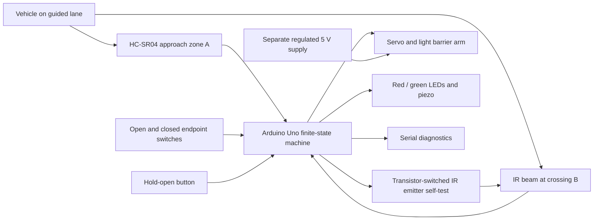
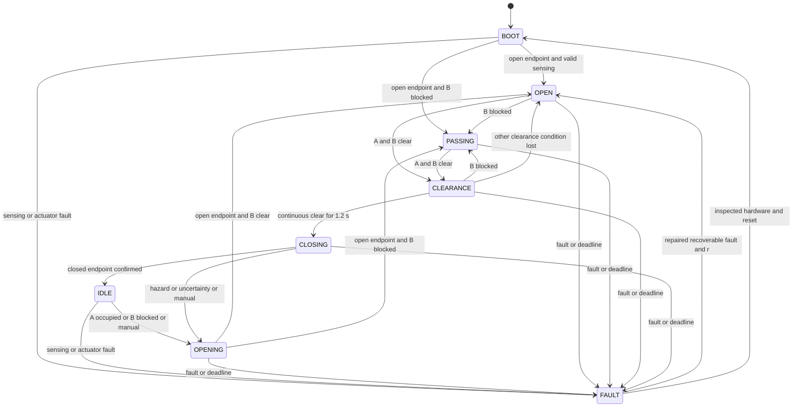
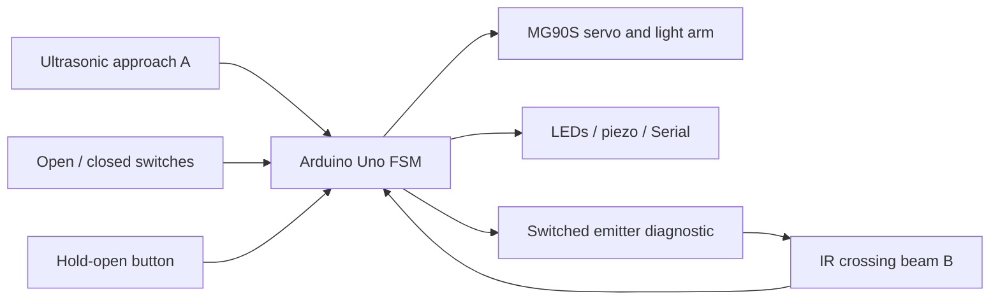
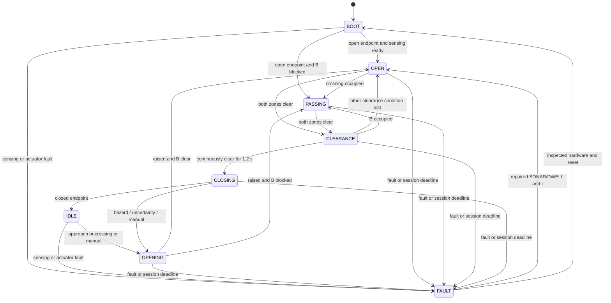

# Smart Parking Barrier — Complete Build Guide

Prepared for Task 3. Software is verified; physical build and validation remain pending. This guide follows the requested 17-part order and includes the full firmware and README.

## 1. Task interpretation

The supplied form asks for a working approach → open → passed → close sequence and a project URL with an explanation. It does not supply a grading rubric. The following judging criteria are engineering inferences: visible completion of the sequence, repeatability, justified hardware choices, readable firmware, handling of stopped vehicles, and credible test evidence.

Approach means confirmed vehicle presence before the barrier, not one noisy echo. Open means the open endpoint is physically reached, not merely that `Servo.write()` ran. Passed means an occupied crossing becomes clear; it is different from a timer expiring. Safe closure requires a known-clear approach zone and crossing for a continuous interval, with monitoring during the downward movement.

Functional requirements:

- Detect a model vehicle before the arm and open automatically.
- Confirm both arm endpoints with physical switches.
- Hold open for occupancy, uncertainty or manual hold.
- Confirm crossing occupancy and subsequent clearance, then close.
- Handle abandoned approaches, reverse movements and successive vehicles without requiring a controller reset.
- Report state, measurements, sensor validity and faults over Serial.

Safety requirements:

- Missing sonar echoes are UNKNOWN, never evidence of clear space.
- A timer may trigger an open fault; it cannot override an occupied zone.
- A new hazard while closing requests opening on the next loop, subject to the bounded beam diagnostic interval and physical actuator response.
- Boot requests opening, then establishes sensing and checks clearance before closing.
- Actuator faults latch, stop command pulses and prohibit automatic reattachment.

## 2. Recommended final architecture

Arduino Uno R3 + one HC-SR04 approach sensor + one through-beam IR crossing sensor + MG90S positional servo + two lever microswitches. Red/green LEDs, a passive piezo and a hold-open button make operation visible. A transistor switches the IR emitter for a short diagnostic test.

This is a two-zone design: A is approach; B is the crossing/clearance plane immediately beyond the arm. There is no separate distant exit sensor. The crossing beam observes the vehicle front entering and the trailing edge leaving. A fixed sonar backboard makes the empty lane produce a valid echo.

## 3. Why this architecture

| Option | Tradeoff | Decision |
|---|---|---|
| One ultrasonic sensor and a delay | Cannot distinguish waiting, passing and reversing; cannot prove clearance | Reject |
| Two HC-SR04 sensors | Kit friendly, but echoes need scheduling and two distant zones can leave a blind spot | Viable learning fallback; not supplied final build |
| HC-SR04 + reflective IR obstacle module | Cheap; reflection depends on vehicle surface and background | Avoid for final crossing clearance |
| HC-SR04 + through-beam IR | Different sensing mechanisms, direct body interruption, no ultrasonic cross-talk | Select |
| Uno R3 | 5 V sensor compatibility, two external interrupts, sufficient memory, no radio setup | Select |
| ESP32 | Useful for networking; needs 5 V Echo level shifting and different firmware/pins | No meaningful advantage for this task |


This is a supervised tabletop prototype, not a road-access safety product. Its software prevents planned closure while the observed zones are occupied or uncertain. That is conditional on correct wiring, validated sensing coverage, vehicle geometry and actuator response. It cannot guarantee that an arbitrary object is never struck.

Use an opaque model body at least 18 cm long, about 7 cm wide and 5 cm high, guided straight through the lane at no more than 3 cm/s. The two sensing planes are 13 cm apart. The body must continuously intersect both sensing heights; a gap between the sensors must not hide a permitted vehicle. The IR beam is 1 cm downstream of the arm centre, beyond its swept thickness. Evaluate and mark the real swept envelope before gluing mounts.

The IR test briefly removes the beam for about 6 ms every 250 ms. The last observation is retained during that interval; closure cannot start during it. An object arriving during a test is seen after the emitter settles. At 3 cm/s, 6 ms is 0.18 mm of travel; loop latency and mechanical reversal time must also be measured. Obstruction assertion is unfiltered; clearance is filtered. Tests detect a signal permanently shorted LOW, but cannot prove optical alignment, immunity to all ambient interference or redundant fail-safe operation.

An open beam wire or failed emitter reads blocked with the specified receiver and pull-up. That causes an open hold and eventually a dwell fault. A receiver with the opposite polarity is NOT a drop-in replacement. Some vendor tutorial text is contradictory; measure illuminated, blocked and emitter-off states before attaching the arm.

Endpoint switches prove two positions, not torque, intermediate position or obstacle contact. A jam may leave the arm partly lowered. `detach()` stops command pulses; it is not power isolation and servo behaviour without pulses must be checked. Remove external servo power for a jam. Use a very light breakaway arm and supervise operation. Power loss itself does not guarantee the arm stays raised: boot-open is a restart policy, not a mechanical fail-open guarantee.

| Feature | Decision |
|---|---|
| Red/green LEDs | Implemented; green only after open endpoint confirmed |
| Passive piezo | Implemented; closing warning and latched-fault indication |
| Hold-open button | Implemented; cannot force-close or override a jam |
| Endpoint switches | Implemented; replace guessed motion completion with feedback |
| Emitter self-test | Implemented; catches a dangerous static clear signal |
| OLED / LCD | Omit; Serial plus LEDs already expose the required states |
| Vehicle counter / EEPROM count | Omit; reversing and close tailgating make exact counting ambiguous |
| Emergency stop | Software button is not an E-stop; external servo supply switch is only a manual isolator |
| ESP32 web dashboard / Wi-Fi | Future extension after physical verification; not needed for evaluation |
| AI / ML | No benefit for this controlled sensing problem |

Sources:
- [Arduino Uno R3 specifications](https://store.arduino.cc/products/arduino-uno-rev3): 5 V ATmega328P platform and D2/D3 interrupt capability.
- [HC-SR04 datasheet hosted by SparkFun](https://cdn.sparkfun.com/datasheets/Sensors/Proximity/HCSR04.pdf): trigger pulse, Echo conversion and measurement spacing. Its small-target performance must be checked on the actual model.
- [Adafruit receiver product](https://www.adafruit.com/product/2168): open-collector receiver requires a pull-up.
- [Manufacturer support clarification](https://forums.adafruit.com/viewtopic.php?p=731270): illuminated phototransistor LOW, interrupted beam HIGH. Verify the purchased part.
- [Arduino Servo API](https://github.com/arduino-libraries/Servo/blob/master/docs/api.md): `read()` returns a commanded position, not mechanical feedback.
- [AVR Servo implementation](https://github.com/arduino-libraries/Servo/blob/master/src/avr/Servo.cpp): timer-based pulses and target preload before attachment.

References checked 2026-09-12. Original design choices and prototype dimensions above are engineering assumptions to validate, not vendor guarantees.

## 4. System block diagram



## 5. State machine + Mermaid diagram

Global priority: actuator contradiction/jam → stop fault; persistent sensing fault → open fault; session deadline → open fault. These checks apply before ordinary transitions. Manual assertion is immediate; its release goes through normal clearance verification.

| State | Entry and actions | Sensor condition / transition | Timeout or fault |
|---|---|---|---|
| BOOT | Reset; command OPEN; red | Open endpoint confirmed + healthy A + beam test performed → OPEN or PASSING | No valid A by 2 s → SONAR; actuator limit checks always active |
| IDLE | Closed endpoint verified; red | Confirmed A occupied, B blocked or manual → OPENING | Persistent sensing fault → FAULT/open |
| OPENING | Command OPEN; red | Open endpoint confirmed → PASSING if B blocked, otherwise OPEN | Source endpoint must release within 500 ms; target within 2.5 s |
| OPEN | Arm confirmed open; green | B blocked → PASSING; both zones clear → CLEARANCE | 30 s automatic session deadline → DWELL/open |
| PASSING | B occupied now or earlier; hold open | Both zones clear → CLEARANCE; otherwise stay | Same dwell deadline; no forced closure |
| CLEARANCE | Keep open; start fresh continuous-clear timer | Hazard → PASSING/OPEN; clear for 1.2 s and beam test inactive → CLOSING | Same dwell deadline |
| CLOSING | Command CLOSE; red + warning chirps | Any clear-condition loss → OPENING; closed endpoint → IDLE | 500 ms departure / 2.5 s arrival; timeout → stopped actuator fault |
| FAULT | Red flashes; fault chirps | Repaired SONAR/DWELL: `r` accepted only when open, both zones clear and manual released | BEAM_TEST and actuator/limit faults require physical inspection and reset; no automatic retry |



## 6. BOM

### Bill of materials

No exact local prices are claimed. Reuse the Uno, sonar, LEDs, jumpers and piezo from a student kit; the useful additions are the beam pair, two switches and a stable servo supply. Obtain local quotes before buying.

| Component | Qty | Purpose | Recommended model/specification | Alternatives / constraints |
|---|---:|---|---|---|
| Controller | 1 | FSM and diagnostics | Arduino Uno R3, ATmega328P, 5 V | Compatible Uno R3 clone; classic 5 V Nano with board-selection adjustment |
| Ultrasonic module | 1 | Approach presence and empty-lane echo | HC-SR04, 5 V | Same pin-compatible module after distance validation |
| IR emitter + receiver pair | 1 pair | Crossing and trailing-edge clearance | 5 V IR through-beam pair; receiver open-collector, LOW when illuminated, HIGH when blocked; e.g. verify Adafruit 2168 | Matching through-beam module with this truth table; reflective IR module is not equivalent |
| Positional servo | 1 | Raise lightweight arm | MG90S, 5 V, standard positional | Kit SG90 for foam arm; do not use continuous-rotation servo |
| Lever microswitch | 2 | Actual open/closed endpoints | SPDT lever switch, use COM and NO | Low-force lever switches with adjustable mounts |
| NPN transistor | 1 | Switch IR emitter ground | PN2222A/2N2222A; verify exact package pinout | BC547 for emitter current within its rating; pinout differs |
| Base resistor | 1 | Limit NPN base current | 1 kΩ, 1/4 W | 820 Ω–1.5 kΩ after current check |
| Base pull-down | 1 | Emitter off while controller resets | 10 kΩ | 10–47 kΩ |
| Beam pull-up | 1 | Defined blocked/unplugged HIGH | 10 kΩ | 4.7–10 kΩ |
| Echo pull-down | 1 | Defined idle Echo if unplugged | 10 kΩ | 10–47 kΩ |
| Servo signal pull-down | 1 | Defined LOW while controller resets | 10 kΩ | 10–47 kΩ |
| LEDs | 2 | Red stop/fault, green open | Red and green 3/5 mm | Kit LEDs |
| LED resistors | 2 | LED current limiting | 330 Ω, 1/4 W | 220–470 Ω, confirm LED current |
| Passive piezo | 1 | Audible closing/fault status | Low-current bare piezo transducer | Omit physically if unavailable; no firmware change needed |
| Piezo resistor | 1 | Limit transient GPIO current | 100 Ω | 100–220 Ω |
| Momentary pushbutton | 1 | Hold-open request | Normally open tactile switch | Any dry-contact momentary NO button |
| Servo power supply | 1 | Handle motor current separately | Regulated 5 V, 2 A supply from reputable source | Current-limited bench supply set to 5 V; verify actual servo peak/stall demand |
| Servo isolator | 1 | Remove actuator power for setup/jam | Inline switch rated for supply current | Bench supply output switch; not a certified E-stop |
| Bulk capacitor | 1 | Reduce servo supply transients | 470–1000 µF electrolytic, ≥10 V | Size after supply transient measurement |
| Decoupling capacitor | 2–3 | Local logic supply bypass | 100 nF ceramic | At sonar/receiver and near emitter supply |
| USB cable | 1 | Logic power, programming, Serial | Uno-compatible USB data cable | Verify data-capable cable |
| Breadboard/perfboard, jumpers | 1 set | Interconnect | Breadboard for bring-up, perfboard for final | Screw terminals for servo power |
| Base, foam arm, backboard, fasteners | 1 set | Physical prototype | 65 × 30 cm base, lightweight breakaway arm | Foam board/cardboard/plywood base |

#### Practical fallback

Use the same final firmware with an Uno clone, SG90, and matching-polarity inexpensive through-beam pair. Keep the arm light and recalibrate angles. Piezo may be omitted; red/green status remains. Two NO pushbuttons may substitute for endpoint switches **only during supervised bench logic testing**, never as a finished automated build.

If only HC-SR04/reflective IR kit sensors are available, assemble the road, sonar and servo for bring-up and purchase the missing beam pair and endpoint switches before claiming this final design is implemented. Do not silently bypass the beam, spoof a limit input, or swap an ultrasonic sensor onto the beam pin. There is one maintained firmware, with no weaker automatic fallback mode.

## 7. Complete wiring

### Exact wiring — Uno R3 only

All signal names match the final sketch. Switches use `INPUT_PULLUP`: COM to ground, NO to input, pressed endpoint = LOW. Identify the transistor's base/collector/emitter from its specific datasheet; similar-looking packages have different pin orders.

| Uno pin / rail | Connection |
|---|---|
| D4 | HC-SR04 TRIG |
| D2 | HC-SR04 ECHO; add 10 kΩ from D2 to GND |
| 5V logic rail | HC-SR04 VCC |
| GND | HC-SR04 GND |
| D3 | IR receiver signal; add 10 kΩ from D3 to Uno 5V |
| Uno 5V / GND | IR receiver VCC / GND |
| Uno 5V | IR emitter positive (module with internal current limiting) |
| D5 → 1 kΩ | NPN base |
| NPN base → 10 kΩ | GND |
| NPN emitter | GND |
| NPN collector | IR emitter negative; do not also connect emitter negative to GND |
| D9 | Servo signal, usually orange/yellow; 10 kΩ from D9 to GND |
| External regulated +5V, through supply switch | Servo positive, usually red |
| External supply GND | Servo ground, usually brown/black, AND Uno GND |
| D6 → 330 Ω | Red LED anode; cathode → GND |
| D7 → 330 Ω | Green LED anode; cathode → GND |
| D8 → 100 Ω | Passive piezo positive; other terminal → GND |
| A0 | OPEN endpoint switch NO; COM → GND |
| A1 | CLOSED endpoint switch NO; COM → GND |
| A2 | Hold-open button; other contact → GND |
| USB | Uno logic supply and Serial connection |

Add 470–1000 µF across the external servo +5V/GND close to its connector, observing electrolytic polarity. Add 100 nF at HC-SR04 and IR receiver supply pins. Route servo return directly to the external supply; join logic ground at a common point. Avoid carrying motor current through breadboard rails or the Uno.

```text
 COMPUTER USB ───────────── UNO R3 (5 V logic)
                             D4 ───────────── HC-SR04 TRIG
                             D2 ──────+────── HC-SR04 ECHO
                                      10k
                                       │
                                      GND
                             5V ───────────── HC-SR04 VCC
                            GND ───────────── HC-SR04 GND

              UNO 5V ──10k───+── D3 ───────── IR receiver OUT
              UNO 5V ──────────────────────── IR receiver VCC
                 GND ──────────────────────── IR receiver GND

              UNO 5V ───────── IR emitter + (current-limited module)
                               IR emitter − ─── collector Q1
                             D5 ──1k── base Q1
                                       │       emitter Q1 ── GND
                                      10k
                                       │
                                      GND

 D6 ──330Ω──>| RED ── GND       A0 ── OPEN switch NO; COM ── GND
 D7 ──330Ω──>| GREEN ─ GND      A1 ── CLOSED switch NO; COM ─ GND
 D8 ──100Ω── PIEZO ─── GND      A2 ── hold-open pushbutton ─ GND

                             D9 ──────+────── SERVO signal
                                      10k
                                       │
                                      GND
 EXTERNAL 5 V / 2 A ── switch ──────+──────── SERVO +
                                    │ +
                                 470–1000µF
                                    │ −
 EXTERNAL GND ───────────────────────+──────── SERVO GND
        │
        └──────────────────────────────────── UNO GND
```

#### Power and electrical cautions

- Do not power the servo from an Uno GPIO, its onboard regulator or the computer USB path. A 2 A supply is a design allowance, not a measured MG90S peak specification.
- Common ground is mandatory. Do not connect external servo +5 V to Uno +5 V while USB powers the Uno; only join grounds.
- The external supply's regulated 5 V is for the servo; do not feed it into Uno VIN, which is a regulator input requiring headroom.
- The selected IR emitter is a ready-made current-limited module. A bare IR LED requires a calculated series resistor and is not a wire-for-wire replacement.
- A passive piezo is appropriate for this GPIO circuit. A high-current active/magnetic buzzer requires a driver stage.
- Uno R3 uses 5 V logic, so HC-SR04 Echo connects directly. **If ported to an ESP32, its GPIO is 3.3 V only:** use a 10 kΩ top / 15 kΩ bottom Echo divider (5 V → 3.0 V), pull receiver output to 3.3 V, and redesign the complete pin map/software. Do not run this Uno wiring on ESP32.
- Never connect the two endpoint inputs permanently to ground. That simulates endpoints and defeats motion verification.

#### Mandatory beam truth-table check

With the arm removed, measure D3 relative to GND:

| Condition | Required input |
|---|---|
| Emitter powered and correctly aligned | LOW |
| Opaque model blocks beam | HIGH |
| Emitter disabled by D5 LOW | HIGH |
| Receiver signal disconnected from D3 | HIGH due to pull-up |

Do not reverse a constant merely to suppress a fault. An inverted receiver needs a deliberately redesigned diagnostic circuit and tests. The current final firmware assumes this exact table.

## 8. Complete final firmware

Target: Uno R3; this is the complete maintained sketch.

```cpp
// Smart Parking Barrier -- Arduino Uno R3 / ATmega328P, Servo 1.3.0
// Pin map and build constraints: ../../docs/wiring.md and construction.md.
#include <Arduino.h>
#include <Servo.h>

constexpr uint8_t TRIG_PIN=4, ECHO_PIN=2, BEAM_PIN=3, EMITTER_PIN=5;
constexpr uint8_t RED_PIN=6, GREEN_PIN=7, BUZZER_PIN=8, SERVO_PIN=9;
constexpr uint8_t OPEN_LIMIT_PIN=A0, CLOSED_LIMIT_PIN=A1, MANUAL_PIN=A2;
constexpr uint8_t OPEN_ANGLE=95, CLOSED_ANGLE=10; // Calibrate without arm first.
constexpr uint16_t OCCUPIED_MM=160, CLEAR_MM=200, MIN_MM=20, MAX_MM=350;
constexpr uint32_t PING_MS=65, ECHO_TIMEOUT_US=25000, STALE_MS=300;
constexpr uint32_t BEAM_TEST_MS=250, BEAM_PHASE_MS=3, BEAM_CLEAR_MS=100;
constexpr uint32_t DEBOUNCE_MS=20, CLEARANCE_MS=1200, TRAVEL_MS=2500;
constexpr uint32_t DEPART_MS=500, SESSION_MS=30000, STARTUP_MS=2000;
constexpr uint8_t CONFIRM_SAMPLES=3, BAD_LIMIT=3;

enum class State : uint8_t { BOOT, IDLE, OPENING, OPEN, PASSING,
                            CLEARANCE, CLOSING, FAULT };
enum class Fault : uint8_t { NONE, SONAR, BEAM_TEST, DWELL, LIMITS, ACTUATOR };
enum class Demand : uint8_t { OPEN, CLOSE, STOP };

struct Debounced {
  bool raw=false, active=false;
  uint32_t changed=0;
  void update(bool value, uint32_t now) {
    if(value!=raw) { raw=value; changed=now; }
    if(uint32_t(now-changed)>=DEBOUNCE_MS) active=raw;
  }
};
struct Range {
  uint16_t mm=0;
  uint8_t nearRun=0, clearRun=0, badRun=0;
  bool occupied=false, valid=false, everValid=false;
  uint32_t lastGood=0;
  void sample(uint16_t value, bool ok, uint32_t now) {
    valid=ok && value>=MIN_MM && value<=MAX_MM;
    if(!valid) {
      if(badRun<255) ++badRun;
      nearRun=clearRun=0; // Unknown is never a clear measurement.
      return;
    }
    mm=value; lastGood=now; everValid=true; badRun=0;
    if(mm<=OCCUPIED_MM) {
      clearRun=0;
      if(nearRun<CONFIRM_SAMPLES) ++nearRun;
      if(nearRun>=CONFIRM_SAMPLES) occupied=true;
    } else if(mm>=CLEAR_MM) {
      nearRun=0;
      if(clearRun<CONFIRM_SAMPLES) ++clearRun;
      if(clearRun>=CONFIRM_SAMPLES) occupied=false;
    } else { nearRun=clearRun=0; } // Hysteresis band retains occupancy.
  }
  bool healthy(uint32_t now) const {
    return valid && everValid && uint32_t(now-lastGood)<STALE_MS;
  }
  bool clear(uint32_t now) const {
    return healthy(now) && !occupied && clearRun>=CONFIRM_SAMPLES && mm>=CLEAR_MM;
  }
  bool failed(uint32_t now) const {
    return badRun>=BAD_LIMIT ||
      (everValid && uint32_t(now-lastGood)>=STALE_MS);
  }
};

Servo barrier;
Range approach;
Debounced openLimit, closedLimit;
State state=State::BOOT;
Fault fault=Fault::NONE;
Demand demand=Demand::OPEN;
bool actuatorStopped=false, moving=true, manual=false;
bool beamBlocked=true, beamClear=false, beamTestFault=false, beamTestPassed=false;
bool beamClearTiming=false, clearanceTiming=false, sourceReleased=false;
bool approachSeen=false, crossingSeen=false, forwardEvidence=false;
uint8_t beamPhase=0; // 0=normal, 1=emitter off, 2=settling after on.
uint32_t bootAt=0, sessionAt=0, travelAt=0, clearanceAt=0;
uint32_t beamPhaseAt=0, beamTestAt=0, beamClearAt=0, debugAt=0;
uint32_t pingAt=0, pingStartedUs=0;
bool pingWaiting=false;
volatile bool echoArmed=false, echoRisen=false, echoDone=false;
volatile uint32_t echoRiseUs=0, echoWidthUs=0;

void echoISR() {
  if(!echoArmed) return;
  if(digitalRead(ECHO_PIN)==HIGH) {
    if(!echoRisen) { echoRiseUs=micros(); echoRisen=true; }
  } else if(echoRisen) {
    echoWidthUs=uint32_t(micros()-echoRiseUs);
    echoDone=true; echoArmed=false;
  }
}

// Asynchronous echo capture; only the 10 us trigger pulse is synchronous.
void readDistance(uint32_t now) {
  if(pingWaiting) {
    noInterrupts();
    bool done=echoDone;
    uint32_t width=echoWidthUs;
    interrupts();
    if(done || uint32_t(micros()-pingStartedUs)>=ECHO_TIMEOUT_US) {
      noInterrupts(); echoArmed=false; echoDone=false; interrupts();
      pingWaiting=false;
      approach.sample(done ? uint16_t(width*10UL/58UL) : 0,
                      done && width<=ECHO_TIMEOUT_US, now);
    }
  }
  if(!pingWaiting && uint32_t(now-pingAt)>=PING_MS) {
    pingAt=now;
    if(digitalRead(ECHO_PIN)==HIGH) { approach.sample(0,false,now); return; }
    noInterrupts();
    echoRisen=false; echoDone=false; echoArmed=true;
    interrupts();
    pingStartedUs=micros(); pingWaiting=true;
    digitalWrite(TRIG_PIN,HIGH);
    delayMicroseconds(10);
    digitalWrite(TRIG_PIN,LOW);
  }
}

void updateBeam(uint32_t now) {
  if(beamPhase==1 && uint32_t(now-beamPhaseAt)>=BEAM_PHASE_MS) {
    // Specified receiver: illuminated=LOW; emitter off must produce HIGH.
    if(digitalRead(BEAM_PIN)!=HIGH) beamTestFault=true;
    else { beamTestPassed=true; beamTestAt=now; }
    digitalWrite(EMITTER_PIN,HIGH);
    beamPhase=2; beamPhaseAt=now;
  } else if(beamPhase==2 && uint32_t(now-beamPhaseAt)>=BEAM_PHASE_MS) {
    beamPhase=0;
  }
  if(beamPhase!=0) return; // Retain last observation during bounded 6 ms test.
  beamBlocked=digitalRead(BEAM_PIN)==HIGH;
  if(beamBlocked) { beamClear=false; beamClearTiming=false; }
  else {
    if(!beamClearTiming) { beamClearAt=now; beamClearTiming=true; }
    beamClear=uint32_t(now-beamClearAt)>=BEAM_CLEAR_MS;
  }
  if(uint32_t(now-beamTestAt)>=BEAM_TEST_MS) {
    digitalWrite(EMITTER_PIN,LOW);
    beamPhase=1; beamPhaseAt=now;
  }
}

bool isVehicleApproaching() { return approach.occupied; }
bool isExitOccupied() { return beamBlocked; }
bool allClear(uint32_t now) {
  return approach.clear(now) && beamClear && !beamBlocked &&
         beamTestPassed && !beamTestFault && !manual;
}

void changeState(State next) {
  state=next;
  clearanceTiming=false;
}

void setBarrier(Demand next, uint32_t now) {
  if(actuatorStopped && next!=Demand::STOP) return;
  if(next==Demand::STOP) {
    barrier.detach(); digitalWrite(SERVO_PIN,LOW);
    demand=next; moving=false; actuatorStopped=true; return;
  }
  if(demand==next && barrier.attached()) return;
  demand=next; travelAt=now; moving=true; sourceReleased=false;
  // Preload the target before attach: avoid the Servo default centre pulse.
  barrier.write(next==Demand::OPEN ? OPEN_ANGLE : CLOSED_ANGLE);
  if(!barrier.attached()) barrier.attach(SERVO_PIN);
}

void enterFault(Fault reason, uint32_t now, bool stopActuator=false) {
  if(fault==Fault::NONE || stopActuator) fault=reason;
  changeState(State::FAULT);
  setBarrier(stopActuator ? Demand::STOP : Demand::OPEN,now);
}

void superviseActuator(uint32_t now) {
  if(actuatorStopped) return;
  if(openLimit.active && closedLimit.active) {
    enterFault(Fault::LIMITS,now,true); return;
  }
  bool target=demand==Demand::OPEN ? openLimit.active : closedLimit.active;
  bool source=demand==Demand::OPEN ? closedLimit.active : openLimit.active;
  if(!moving) {
    if(!target || source) enterFault(Fault::ACTUATOR,now,true);
    return;
  }
  if(!source) sourceReleased=true;
  if(target && !source) { moving=false; return; }
  if((sourceReleased && source) ||
     (source && uint32_t(now-travelAt)>=DEPART_MS) ||
     uint32_t(now-travelAt)>=TRAVEL_MS)
    enterFault(Fault::ACTUATOR,now,true);
}

void startOpening(uint32_t now, bool newSession) {
  if(newSession) {
    sessionAt=now;
    approachSeen=isVehicleApproaching();
    crossingSeen=false; forwardEvidence=false;
  }
  setBarrier(Demand::OPEN,now);
  changeState(State::OPENING);
}

void updateStateMachine(uint32_t now) {
  if(state==State::FAULT) return;
  if(beamTestFault) { enterFault(Fault::BEAM_TEST,now); return; }
  if(approach.failed(now) ||
     (uint32_t(now-bootAt)>=STARTUP_MS && !approach.everValid)) {
    enterFault(Fault::SONAR,now); return;
  }
  if(state==State::IDLE) {
    if(isVehicleApproaching() || isExitOccupied() || manual)
      startOpening(now,true);
    return;
  }
  if(manual) sessionAt=now; // Intentional hold-open has no dwell deadline.
  if(state!=State::BOOT && uint32_t(now-sessionAt)>=SESSION_MS) {
    enterFault(Fault::DWELL,now); return; // Never force-close on timeout.
  }
  approachSeen=approachSeen || isVehicleApproaching();
  if(isExitOccupied()) {
    crossingSeen=true;
    if(approachSeen && approach.clear(now)) forwardEvidence=true;
  }
  switch(state) {
    case State::BOOT:
      if(!moving && openLimit.active && approach.healthy(now) && beamTestPassed) {
        sessionAt=now;
        changeState(isExitOccupied() ? State::PASSING : State::OPEN);
      }
      break;
    case State::OPENING:
      if(!moving && openLimit.active)
        changeState(isExitOccupied() ? State::PASSING : State::OPEN);
      break;
    case State::OPEN:
      if(isExitOccupied()) changeState(State::PASSING);
      else if(allClear(now)) changeState(State::CLEARANCE);
      break;
    case State::PASSING:
      if(allClear(now)) changeState(State::CLEARANCE);
      break;
    case State::CLEARANCE:
      if(!allClear(now)) {
        changeState(isExitOccupied() ? State::PASSING : State::OPEN);
      } else {
        if(!clearanceTiming) { clearanceTiming=true; clearanceAt=now; }
        if(uint32_t(now-clearanceAt)>=CLEARANCE_MS && beamPhase==0) {
          setBarrier(Demand::CLOSE,now); changeState(State::CLOSING);
        }
      }
      break;
    case State::CLOSING:
      // Raw/latest hazards override filtered confirmation while moving down.
      if(!allClear(now)) startOpening(now,false);
      else if(!moving && closedLimit.active) changeState(State::IDLE);
      break;
    default: break;
  }
}

void updateSensors(uint32_t now) {
  manual=digitalRead(MANUAL_PIN)==LOW; // Immediate assertion; release is clearance-gated.
  openLimit.update(digitalRead(OPEN_LIMIT_PIN)==LOW,now);
  closedLimit.update(digitalRead(CLOSED_LIMIT_PIN)==LOW,now);
  updateBeam(now);
  readDistance(now);
}

void setIndicators(uint32_t now) {
  bool green=fault==Fault::NONE && !moving && openLimit.active &&
    (state==State::OPEN || state==State::PASSING || state==State::CLEARANCE);
  bool red=state==State::FAULT ? ((now/250)%2==0) : !green;
  digitalWrite(GREEN_PIN,green ? HIGH : LOW);
  digitalWrite(RED_PIN,red ? HIGH : LOW);
  // Passive piezo only. tone uses Timer2; Servo uses Timer1 on Uno R3.
  bool beep=(state==State::FAULT && now%1000<150) ||
            (state==State::CLOSING && now%500<70);
  static bool sounded=false;
  if(beep!=sounded) {
    if(beep) tone(BUZZER_PIN,2200); else noTone(BUZZER_PIN);
    sounded=beep;
  }
}

void printDebug(uint32_t now) {
  if(uint32_t(now-debugAt)<250 || Serial.availableForWrite()<60) return;
  debugAt=now;
  // Fixed, bounded record (<60 bytes). State/fault numeric legend in README.
  Serial.print(F("s=")); Serial.print(uint8_t(state));
  Serial.print(F(" f=")); Serial.print(uint8_t(fault));
  Serial.print(F(" mm=")); Serial.print(approach.mm);
  Serial.print(F(" v=")); Serial.print(approach.valid);
  Serial.print(F(" a=")); Serial.print(approach.occupied);
  Serial.print(F(" b=")); Serial.print(beamBlocked);
  Serial.print(F(" o=")); Serial.print(openLimit.active);
  Serial.print(F(" c=")); Serial.print(closedLimit.active);
  Serial.print(F(" p=")); Serial.println(forwardEvidence);
}

void serviceSerial(uint32_t now) {
  if(!Serial.available()) return;
  char c=Serial.read();
  // 'r' acknowledges sensor/dwell faults after inspection; never a motion fault.
  if(c=='r' && state==State::FAULT && !actuatorStopped &&
     allClear(now) && beamPhase==0 && openLimit.active && !closedLimit.active &&
     !moving) {
    fault=Fault::NONE; sessionAt=now; changeState(State::OPEN);
  }
}

void setup() {
  Serial.begin(115200);
  pinMode(TRIG_PIN,OUTPUT); digitalWrite(TRIG_PIN,LOW);
  pinMode(ECHO_PIN,INPUT);
  pinMode(BEAM_PIN,INPUT_PULLUP);
  pinMode(EMITTER_PIN,OUTPUT); digitalWrite(EMITTER_PIN,HIGH);
  pinMode(RED_PIN,OUTPUT); pinMode(GREEN_PIN,OUTPUT); pinMode(BUZZER_PIN,OUTPUT);
  pinMode(OPEN_LIMIT_PIN,INPUT_PULLUP); pinMode(CLOSED_LIMIT_PIN,INPUT_PULLUP);
  pinMode(MANUAL_PIN,INPUT_PULLUP);
  attachInterrupt(digitalPinToInterrupt(ECHO_PIN),echoISR,CHANGE);
  bootAt=sessionAt=millis();
  // Seed endpoint state from hardware; an initially pressed switch is not a
  // later reactivation of an endpoint that was already left during travel.
  openLimit.raw=openLimit.active=digitalRead(OPEN_LIMIT_PIN)==LOW;
  closedLimit.raw=closedLimit.active=digitalRead(CLOSED_LIMIT_PIN)==LOW;
  openLimit.changed=closedLimit.changed=bootAt;
  setBarrier(Demand::OPEN,bootAt); // Startup never commands closed.
  setIndicators(bootAt);
}

void loop() {
  uint32_t now=millis();
  updateSensors(now);
  // Check actuator first; a jam must prevent all subsequent drive requests.
  superviseActuator(now);
  updateStateMachine(now);
  serviceSerial(now);
  setIndicators(now);
  printDebug(now);
}
```

## 9. Firmware logic explanation

1. Start with red indication and command the arm open. Supervise departure and arrival switches.
2. Acquire asynchronous sonar readings every 65 ms. Require three consecutive occupied/clear readings; retain occupancy in the hysteresis band.
3. Read the crossing beam continuously. Assert blocked immediately, require 100 ms clear, and test emitter-off response every 250 ms.
4. After boot, once the arm is open and sensing is available, wait until both zones are clear for 1.2 s; then close and verify the closed endpoint.
5. From IDLE, confirmed approach, crossing-first activity or manual hold starts opening.
6. Track approach activity and crossing occupation during opening and while open. A clear A while B remains occupied after approach activity records forward-progress evidence (`p=1`). This is diagnostic evidence, not a vehicle count or certified direction measurement.
7. Stay open while A or B is occupied, a reading is uncertain, or the manual button is pressed.
8. Once A and B are confirmed clear, start a fresh 1.2 s clearance interval. Any hazard resets it. At completion, start closing only outside an IR diagnostic blanking interval.
9. During closing, a single invalid sonar result, non-clear latest sonar reading, blocked beam or manual assertion requests reopening. Revalidate clearance afterwards.
10. After 30 s without completing an automatic session, latch an open dwell fault. Sensor faults request open. Actuator faults stop pulses and require inspection and reset.

The filter combines run-length confirmation with hysteresis. The latest reading must also be clear to permit closure. Interrupt capture removes the need for pulseIn; the only deliberate synchronous wait is the 10 microsecond trigger. Endpoint feedback, not Servo.read(), completes movement. Faults retain the open demand unless an actuator fault stops pulses.

### Validation report — 2026-09-12

#### Actually executed

| Check | Result |
|---|---|
| Arduino Uno R3 compile | PASS, FQBN `arduino:avr:uno`, AVR Boards 1.8.6, Servo 1.3.0 |
| Final flash usage | 7,576 / 32,256 bytes (23%) |
| Final static RAM usage | 343 / 2,048 bytes (16%); 1,705 bytes remain for stack/runtime |
| Native test compilation | PASS, C++11, `-Wall -Wextra -Werror`, Zig 0.16.0 C++ frontend on Windows |
| Firmware host scenarios | 30 / 30 PASS; actual `.ino` included with hardware interface stubs |
| Deliverable consistency | PASS: local Markdown links, all 17 guide sections, exact embedded firmware and source ZIP exclusions |
| Physical prototype | NOT BUILT / NOT TESTED in this session |
| Hardware upload | NOT PERFORMED |
| GitHub Actions execution | Pending repository publication; local results are not a remote CI result |

An initial full AVR build emitted unused-parameter warnings in Arduino AVR core `new.cpp`. The final sketch compiled successfully; those were dependency warnings, not errors in this project. Static RAM usage does not establish worst-case stack depth.

#### Passing software scenarios

`normal`, `stop_approach`, `slow`, `under_arm`, `noisy_approach`, `exit_first`, `reverse`, `abandon`, `tailgate`, `sonar_disconnect`, `beam_disconnect`, `beam_short`, `rapid`, `reopen`, `single_invalid_closing`, `jam`, `limits`, `manual`, `dwell`, `hysteresis`, `echo`, `echo_timeout`, `rollover`, `random`, `reset_open`, `reset_mid`, `reset_blocked`, `arrival_timeout`, `lost_endpoint`, `stale`.

The fixed-seed random scenario performs 20,000 scheduler iterations with changing zone inputs and checks closing/stopped-actuator invariants. Other scenarios explicitly test a continuous 30-second occupied hold, manual hold beyond the deadline and timer wraparound.

#### Defect found and corrected

The first normal startup test exposed an endpoint initialization defect. Starting both software switch values as inactive could make an initially pressed closed switch appear to reactivate after departure, falsely tripping the actuator supervisor. Setup now seeds the debouncers from actual switch inputs before the first movement command. The normal boot and explicit open/mid/occupied reset cases pass with that correction.

#### Important limits

- Host scenarios substitute GPIO, clock and servo interfaces. They do not emulate AVR ISR scheduling, motor dynamics or sensor optics/acoustics.
- Most sonar scenarios inject measurements into the production filter; separate Echo tests cover pulse conversion, timeout and `micros()` wraparound.
- Simulated travel is 600 ms; this is not a measured servo result.
- No measured obstruction reaction time, supply transient, target detection margin or real power-loss behaviour is available yet.
- Two-zone occupancy does not guarantee exact direction/counting for arbitrary reversals or multiple vehicles.
- The beam diagnostic detects the specified static stuck-clear failure; it is not a redundant safety circuit.

Re-run software checks after changes, and complete [the physical matrix](testing.md) before changing the README to claim a demonstrated hardware build.

## 10. Physical prototype construction

### Physical construction and bring-up

#### Desk model

Use a 65 × 30 cm base with a 14 cm wide, straight, guided lane. Label entry, zone A, barrier, zone B and exit. Use dark road card, thin white lane markings and a white arm with red stripes. Hide wire runs beneath the base and mount the controller on standoffs beside the lane. Use removable sensor brackets until calibration is complete.

Coordinates: x runs along vehicle travel; the arm centre is x = 0. Place the approach sensor plane at x = −12 cm and the beam at x = +1 cm. Lane guides constrain vehicles laterally. Put the sonar perpendicular to the lane at about 2.5 cm above the road; the opposing flat backboard is 24 cm from the sensor face. Centre the 7 cm wide model body about 12 cm from that face, giving an occupied return near 8.5 cm. Keep both transducers unobstructed; do not mount them behind the roadside guide.

```text
TOP VIEW — travel left to right

             x=-12 cm                x=0   x=+1 cm
             sonar A                 arm   IR beam B
                 ↓                     │     ↓ TX
 ENTRY  ═══════════════════════════════│═════┆══════════ EXIT
        [18 cm opaque model body]  →   │     ┆
        ═══════════════════════════════│═════┆══════════
                 ▬ flat backboard            RX
                 24 cm from sonar

 A and B separation = 13 cm; permitted body length ≥18 cm.
 Beam B is just beyond the arm's downstream swept edge.
```

Use an 18 × 7 × 5 cm opaque foam/cardboard model car with uninterrupted side panels at sensor height. Wheels can be bottle caps; avoid cutouts across the beam height. A tiny die-cast car is not automatically suitable: make an opaque body sleeve or adjust and revalidate the geometry. Move at ≤3 cm/s and wait for green before entering the arm area.

Mount the servo pivot approximately 4 cm above the road. Build a 14–16 cm foam-board or drinking-straw arm, preferably under 5 g. Use a breakaway paper/tape coupling. The arm rotates upward in a vertical plane across the road; keep its thickness along x below 1 cm. Place the IR beam at approximately 2.5 cm high and x=+1 cm, downstream of the entire swept envelope. Confirm that the car blocks B whenever any permitted part could contact the descending arm.

Fit an adjustable cam to the arm pivot to press the open switch only at the raised endpoint and the closed switch only at the lowered endpoint. The switches must sense the arm linkage, not a loose servo horn independently of the arm. Use low-force levers; avoid making the servo push hard against a switch or rigid stop. Calibrate the target angles and switch positions together. Defaults 10°/95° are starting values, not guaranteed mechanics.

For scale: a 5 g uniform 15 cm arm has approximately 0.0375 kg·cm static gravity moment about one end, excluding coupling, friction and switch force. This is a sizing estimate; measure movement and current on the actual assembly. Do not substitute a heavy wooden arm just because a servo's advertised stall torque looks large.

#### Bring-up sequence

1. Photograph and label parts. Verify supply voltage and transistor pinout before connecting power. Keep the arm disconnected.
2. Build logic wiring and common ground. Check resistance between +5 V and ground with power off. Keep external servo +5 V separate from USB logic +5 V.
3. Upload the final sketch with the servo isolated. Actuator faults are expected until endpoint feedback works; do not bypass the switches to make the final system appear operational.
4. Verify beam polarity using a meter: illuminated LOW, blocked HIGH, emitter off HIGH. A scope/logic analyser will reveal short emitter-test pulses. Avoid prolonged test jumpers; power off before changing wiring.
5. Calibrate A with the backboard and actual vehicle. Record 30 empty and 30 occupied readings from Serial. Empty readings should be stably ≥200 mm and below 350 mm; occupied readings should be ≤160 mm and ≥20 mm. If distributions overlap, fix placement/target geometry before changing thresholds.
6. Connect the unloaded servo to its independent supply. Check startup commands opening. Fit and calibrate endpoint cams with the arm absent or replaced by a paper pointer; reset after expected calibration faults. Confirm target reached within 2.5 s and source switch released within 500 ms.
7. Attach the light arm, verify the envelope, and test slowly with a foam block. Check that no arm position catches wiring, beam mounts or fingers.
8. Perform T01–T25 in testing.md. Capture power droop, closing-to-opening response and representative Serial logs. Do not mark a test passed without observation.
9. Secure the wiring and brackets only after repeatable runs. Repeat the core normal/obstruction/reset tests after moving from breadboard to perfboard.

#### Sensor reliability

Only one ultrasonic module is installed, so there is no two-sonar cross-talk. Do not run another ultrasonic demo beside it. A 65 ms ping interval is above the datasheet's recommended 60 ms spacing. Use a rigid backboard perpendicular to the acoustic axis and minimise other reflecting surfaces. A soft, angled or narrow model may miss echoes; add a flat side panel at the measured height. Never translate no echo into free space.

Shade the IR receiver from direct sunlight and use short opaque collars without reducing the vehicle coverage plane. The emitter-off diagnostic is useful against a stuck-clear signal and strong illumination that holds the output low, but it is not a substitute for optical testing under the actual room lighting.

## 11. Testing matrix

### Verification plan and evidence

**Physical status: NOT RUN.** The software report is in [validation.md](validation.md). Simulation does not measure sensor coverage, power integrity, pulse timing on real silicon, mechanical impact or real servo feedback.

Record each physical result in [test-results.csv](test-results.csv). Use PASS / FAIL only after observing the pass criteria; attach log/video names and measured values. Default state sequences below start after BOOT unless reset is the scenario. OPENING/OPEN may be brief depending on sensor timing.

| ID | Input/scenario | Expected state sequence | Barrier behaviour | Pass criteria |
|---|---|---|---|---|
| T01 | Normal vehicle arrival | IDLE → OPENING → OPEN | Opens; green only at endpoint | Three occupied A readings trigger; open switch confirmed within 2.5 s |
| T02 | Vehicle approaches and stops before arm | IDLE → OPENING → OPEN | Remains open | No closing while A occupied; after 30 s FAULT/open |
| T03 | Vehicle crosses normally | OPEN → PASSING → CLEARANCE → CLOSING → IDLE | Closes only after trailing edge clears B and A clears | Fresh 1.2 s clear interval; closed switch confirmed; `p=1` for valid geometry |
| T04 | Very slow vehicle | OPEN → PASSING → CLEARANCE → CLOSING → IDLE | Stays open throughout crossing | Pause 5 s at A/B and 5 s at B; no premature close |
| T05 | Vehicle stops underneath arm | OPEN → PASSING; after deadline FAULT | Holds open | B stays blocked; no downward command even after 30 s |
| T06 | Isolated false/noisy A samples | IDLE | Stays closed | One/two occupied readings followed by clear do not trigger; do not count continuous noise as isolated |
| T07 | B triggers before A / false B pulse | IDLE → OPENING → PASSING/OPEN → CLEARANCE → CLOSING → IDLE | Conservative open, then revalidate clear | No deadlock; no fabricated forward evidence from B-only activation |
| T08 | Vehicle reverses before passing | OPEN → PASSING → CLEARANCE → CLOSING → IDLE | Stays open until both zones empty | Clear B first while A occupied does not close; completed retreat recovers |
| T09 | Second vehicle follows first | PASSING → CLEARANCE → PASSING/OPEN, then normal close | Holds open or reopens for second car | Gap <1.2 s cannot finish clearance; no exact count claim |
| T10 | Disconnect sonar Echo/power | Any → FAULT | Requests open | Latest invalid reading vetoes closing; 3 bad samples or ≥300 ms stale latches SONAR |
| T11 | Controller reset with arm open / partially down / closed | BOOT → OPEN/PASSING → CLEARANCE → CLOSING → IDLE | First command opens | Test all three initial positions; occupied lane never causes automatic close |
| T12 | Rapid repeated beam triggers | OPEN/PASSING, timer repeatedly cancelled | Holds open | 10 ms blocked/clear pulses do not produce a completed-clear interval |
| T13 | New object during closing | CLOSING → OPENING → PASSING/OPEN | Reverses command to open | Measure beam-to-command and mechanical reverse latency; foam block never contacted within permitted geometry/speed |
| T14 | Unplug IR receiver / emitter wire | IDLE → OPENING → PASSING → FAULT | Holds open | D3 pulled HIGH; DWELL after 30 s, not automatic closure |
| T15 | Test D3 shorted LOW | Any → FAULT | Requests open | Emitter-off diagnostic catches fault by next test, nominally <260 ms plus measured loop latency |
| T16 | Jam opening/closing using soft restraint, current-limited supply | OPENING/CLOSING → FAULT | Stops command pulses, does not retry | Source-release timeout 500 ms or target timeout 2.5 s; isolate servo immediately, do not sustain stall |
| T17 | Both endpoint switches active | Any → FAULT | Stops pulses | Contradiction latched after debounce; `r` cannot reattach |
| T18 | Press manual during IDLE/closing; hold 35 s | OPENING → OPEN/PASSING | Holds open with no dwell fault while pressed | Release permits only fresh clearance; cannot override actuator fault |
| T19 | Approach then retreat without reaching B | OPEN → CLEARANCE → CLOSING → IDLE | Closes after verified vacancy | Recovers with no crossing recorded |
| T20 | Ranging inside hysteresis band | OPEN/PASSING | Holds previous occupied state | 160–200 mm does not create confirmed clearance |
| T21 | Supply sag / restart | Fault or BOOT recovery, depending on supply | No intentional startup-close command | Measure 5 V rails during motion; no resets with chosen supply under normal load |
| T22 | Broken endpoint wire / lost endpoint after arrival | Moving/IDLE/OPEN → FAULT | Stops pulses | Target missing → 2.5 s deadline; reported endpoint lost at rest → fault after debounce |
| T23 | Minimum vehicle size, maximum permitted speed, lane extremes | Normal cycle / safe open fault if sensing fails | Never closes on permitted model | Test 18 cm opaque body at ≤3 cm/s throughout guided lateral positions; any contact is FAIL |
| T24 | Recoverable fault repaired | FAULT → OPEN → CLEARANCE → CLOSING → IDLE | Remains open until explicit acknowledgement | SONAR/DWELL: clear lane + open endpoint + `r`; BEAM_TEST/jam requires inspection and reset |
| T25 | Logic power/servo power removed separately | No guarantee while unpowered; BOOT on restore | Observe actual passive mechanics | Document sag/fall, servo loss-of-pulse response and initial pulse behaviour; do not claim mechanical fail-open |

#### Repeatability and measurement

- Run T01/T03 at least 20 times, logging actual completion count and any failures.
- Repeat T05/T08/T09/T13/T23 at least five times with the permitted model.
- For T13 use a logic analyser on D3, D5 and D9 if available; separately film arm reversal at high frame rate. Serial is sampled at 4 Hz and cannot prove millisecond response.
- Measure worst-case loop service delay with a spare debug pin or temporary scope instrumentation if available. The 6 ms beam-test blindness figure excludes loop and physical actuator delay.
- Add independent physical setup/reset evidence; the host tests use simulated endpoint motion and do not validate real servo timing.
- Exercise `millis()` and `micros()` rollover in the included software tests rather than waiting 49 days. Do not modify production timing to fabricate bench results.

#### Host test method

`tests/firmware_tests.cpp` includes the actual `.ino`, substitutes GPIO/Servo/clock interfaces and feeds sensor scenarios. Each named scenario starts in a fresh process. Normal motion is simulated as 600 ms travel with 50 ms departure; these are **test fixture values**, not measured hardware specifications. Most tests inject sonar samples at the filtering boundary; dedicated cases cover Echo interrupt conversion, timeout and wraparound. Every simulated tick asserts that CLOSING implies all clear and that a stopped actuator never reattaches.

The tests cover control behaviour; they do not emulate AVR interrupts, electrical faults exhaustively, ultrasonic propagation, radiation, a bootloader, brownout or servo inertia. CI also compiles against the real AVR core and Servo library.

## 12. Debugging guide

### Debugging guide

Start with the arm disconnected, a current-limited supply and Serial at 115200 baud. Field meanings and numeric state/fault codes are in the README. `mm` holds the last valid distance; always inspect `v` too.

| Symptom | Likely cause | Fix |
|---|---|---|
| Distance always 0 / `v=0` | TRIG/ECHO swapped, missing 5 V/GND, no echo target, disconnected signal | Verify D4 TRIG / D2 ECHO and common GND; place flat target 24 cm away; inspect pulses if available |
| Distance very unstable | Soft/sloped/small target, vibration, power noise, side-wall echoes | Flat opaque side panel, rigid perpendicular backboard, local bypass capacitor, separate motor return |
| Servo jitter | Weak supply, loose ground, rigid stops or switch force | Use separate regulated supply and bulk capacitor; shorten motor wiring; adjust endpoints away from mechanical stops |
| Uno/ESP32 resets when servo moves | Supply sag or motor return current in logic ground | Separate motor supply, common star ground, measure rail transient; ESP32 is not the supplied build |
| Opens but never closes | B blocked/inverted, A not confirmed clear, manual held, latched fault | Inspect `a,b,v,f`; check beam truth table, backboard and thresholds; repair fault then acknowledge only as documented |
| Closes too early | Beam misses body or sits inside/before full arm envelope; undersized/gapped model; wrong sensor placement | Stop demonstration; restore downstream beam, guided opaque body ≥18 cm and validated thresholds; a longer delay cannot fix invisible occupancy |
| Ultrasonic sensors trigger each other | Additional sonar active nearby | Final design has one sonar; disable nearby units, retain 65 ms cadence; a two-sonar redesign needs sequential triggers |
| Detection range too short | Near-field limit, narrow/sloped body, sensor occluded by guide | Keep face clear and ≥2 cm from objects; use flat side panel at sensor height; calibrate physical spacing |
| Servo moves wrong direction | Horn orientation / angle convention | Remove arm, swap and tune OPEN_ANGLE/CLOSED_ANGLE as needed; keep physical OPEN switch on A0 and CLOSED on A1 |
| Immediate BEAM_TEST fault | Wrong receiver polarity, output short LOW, emitter wired permanently on, ambient IR | Check D5 transistor switching and required LOW/HIGH table; shade sensor; do not disable diagnostic |
| ACTUATOR fault | Endpoint not reached, broken switch wire, disconnected servo, binding linkage | Isolate servo power, inspect mechanics and feedback; recalibrate then reset; do not increase timeout to hide a jam |
| LIMITS fault | Both switches pressed/wired LOW simultaneously | Inspect COM/NO wiring and cam geometry; reset only after correction |
| Fault does not clear with `r` | Lane not clear, endpoint missing, manual pressed or nonrecoverable fault | SONAR/DWELL need clear/open conditions; beam self-test and actuator faults require repair and controller reset |

Never test a jam with fingers. Use a soft restraint only long enough to establish a result, watch current and remove actuator power. Stopping pulses is not an electrical power cut.

## 13. Repository structure

```text
smart-parking-barrier/
├── README.md
├── LICENSE
├── .gitignore
├── .gitattributes
├── arduino-cli.yaml
├── .github/workflows/verify.yml
├── firmware/smart_parking_barrier/smart_parking_barrier.ino
├── hardware/bom.md
├── docs/
│   ├── architecture.md
│   ├── wiring.md
│   ├── construction.md
│   ├── testing.md
│   ├── test-results.csv
│   ├── validation.md
│   ├── debugging.md
│   ├── demo.md
│   ├── submission.md
│   ├── publishing.md
│   ├── checklist.md
│   ├── complete-build-guide.md
│   └── images/README.md
├── tests/
│   ├── firmware_tests.cpp
│   ├── run_tests.py
│   └── stubs/{Arduino.h,Servo.h}
└── tools/package_project.py
```

### Publish the repository

Remote publication is pending authenticated repository creation. Do not treat an expected repository address as an existing URL.

The connected GitHub account was identified as `shakeel-Ahamed-A`. The connected tool can work with existing repositories but did not expose repository creation; the inspected in-app browser was signed out. No credentials belong in source files or command text.

Once GitHub authentication is ready, create an empty repository named `smart-parking-barrier` in the intended account. Use a description such as: `Two-zone Arduino parking barrier with clearance sensing, endpoint feedback and tested firmware. Physical validation in progress.` Do not initialise a second README if pushing this existing source history.

From the project root, after confirming the actual new remote URL:

```sh
git remote add origin YOUR_ACTUAL_GITHUB_REPOSITORY_URL
git push -u origin main
```

If GitHub CLI is installed and authenticated, a single equivalent command is:

```sh
gh repo create smart-parking-barrier --public --source . --remote origin --push
```

Do not run that command if a repository already exists or the account is wrong. Verify `gh auth status` and repository ownership first. Keep the visible physical-validation status in the README until the build is demonstrated.

After publishing:

1. Check GitHub Actions: both native tests and Uno compile must pass.
2. View README and Mermaid diagrams on GitHub.
3. Add actual prototype photos, demo link and completed test results in a follow-up commit.
4. Check the public repository and video in a signed-out browser.
5. Submit the actual URL and the paragraph matching the completion stage.

`.tools/`, `build/` and `dist/` are excluded from Git. Never upload installed compilers, cached libraries, authentication files or a claimed hardware test log that was produced by simulation.

## 14. Complete README.md

### Smart Parking Barrier

A two-zone tabletop parking barrier for **Task 3 — Sensors & Embedded Systems (Advanced)**. An Arduino Uno detects an approaching model vehicle, raises the arm, monitors the crossing and closes after verified clearance.

**Status:** design and firmware are implemented. The Uno build and software scenarios are checked in [the validation report](validation.md). Physical assembly, calibration, photographs and demonstration tests are still pending. This repository does not claim hardware results that have not been recorded.

#### Problem statement

> Build a smart parking barrier. The system should detect an approaching vehicle, open the barrier, detect when it has passed, and close the barrier.

The main design decision is to check clearance at the arm itself. A fixed open-time delay cannot tell whether a vehicle is still underneath it.

#### Demo

**Video: pending physical build and recording.** The [85-second shot list](demo.md) covers normal passage, a stopped vehicle under the arm and an abandoned approach. Real prototype photographs will go in [docs/images](images/README.md).

#### Key features

- HC-SR04 approach zone and an IR through-beam crossing zone.
- Enum-based finite-state machine, with distinct opening, passing, clearance and closing states.
- Three consecutive sonar samples and separate occupied/clear thresholds.
- Asynchronous Echo capture with timeout; no `pulseIn()` or long `delay()` calls.
- Continuous-clear interval, plus hazard monitoring and reopen requests during closure.
- Open and closed endpoint switches for actual movement feedback.
- Periodic emitter-off test to detect a beam input stuck LOW/clear.
- Manual hold-open, red/green LEDs, closing chirps and fault indication.
- Latched sensing, dwell and actuator faults with controlled recovery.
- Compile checks and host tests that exercise the actual firmware source.

#### Architecture



The Uno R3 matches the 5 V sonar and has enough pins and memory for this task. Wi-Fi and a display would add setup without improving crossing detection. The IR beam replaces a second ultrasonic sensor, avoiding sonar cross-talk and directly detecting vehicle-body interruption. See [architecture and tradeoffs](architecture.md).

#### Working principle

1. On boot, command OPEN, verify its endpoint and establish sensor readings.
2. Once both zones remain clear for 1.2 seconds, close and verify IDLE.
3. Three occupied approach readings, crossing-first activity or manual hold requests opening.
4. The arm remains open while the vehicle occupies either zone. The crossing beam observes arrival of the front and clearance of the trailing edge.
5. Both zones must be confirmed clear for a new 1.2-second interval before closing starts.
6. New occupancy, uncertain sonar or manual hold during closing requests reopening.
7. A 30-second automatic session timeout raises an open fault; it never forces closure.

An abandoned approach can close after both zones become empty without claiming a completed passage. Reversals and repeated triggers stay within the same session until the lane is clear. Closely following vehicles can share one open interval; exact vehicle counting is not implemented.

#### State machine



The [full state table](architecture.md#state-machine) defines entry actions, guards and deadlines.

#### Hardware

| Part | Quantity |
|---|---:|
| Arduino Uno R3 / ATmega328P compatible | 1 |
| HC-SR04 | 1 |
| IR emitter/receiver through-beam pair | 1 pair |
| MG90S positional servo (SG90 allowed for a light arm) | 1 |
| Lever endpoint microswitch | 2 |
| Red LED, green LED | 1 each |
| Passive piezo and hold-open button | 1 each |
| NPN emitter driver and resistors | 1 set |
| Regulated external 5 V / 2 A servo supply | 1 |
| Capacitors, wiring, base and foam arm | 1 set |

See the [complete BOM and substitutions](../hardware/bom.md). A reflective IR obstacle module is not a drop-in replacement for the crossing beam.

#### Wiring

| Uno connection | Destination |
|---|---|
| D4 / D2 | Sonar TRIG / ECHO; 10 kΩ Echo pull-down |
| D3 | IR receiver OUT; 10 kΩ pull-up to Uno 5 V |
| D5 through 1 kΩ | NPN base; 10 kΩ base-to-GND; collector to emitter negative |
| D9 | Servo signal; 10 kΩ pull-down to GND |
| D6 / D7 through 330 Ω | Red / green LED anodes; cathodes to GND |
| D8 through 100 Ω | Passive piezo; other terminal to GND |
| A0 / A1 | Open / closed NO switch contacts; COM to GND |
| A2 | Hold-open NO button to GND |
| USB | Uno logic power and Serial |
| External +5 V / GND | Servo supply; join external GND to Uno GND |

Sonar and receiver VCC use Uno 5 V; their grounds use Uno GND. The current-limited IR emitter module takes Uno 5 V on its positive wire; its negative wire is switched by the NPN collector. The transistor emitter goes to GND.

**Use [the complete pin-to-pin wiring and ASCII circuit](wiring.md) when assembling.** The servo supply positive must stay separate from Uno USB-powered 5 V. Never power a servo from a GPIO. Confirm the purchased beam receiver gives LOW when illuminated and HIGH when blocked/emitter-off. This pin map is for the 5 V Uno R3, not ESP32.

#### Software requirements

- Arduino IDE 2.x, or Arduino CLI.
- Arduino AVR Boards **1.8.6**; board **Arduino Uno**, FQBN `arduino:avr:uno`.
- Arduino **Servo 1.3.0** library.
- Serial Monitor at **115200 baud**.
- Optional host verification: Python 3 and a C++11 compiler.

#### Installation

1. Download/clone this repository.
2. Open `firmware/smart_parking_barrier/smart_parking_barrier.ino` in Arduino IDE. Keep the matching folder/sketch names.
3. Install the board package and Servo version above. Select Arduino Uno and the actual connected serial port.
4. Keep the arm disconnected while checking wiring, sensor polarity and endpoint calibration.
5. Compile, upload, then open Serial Monitor at 115200.
6. Complete [construction and bring-up](construction.md) before attaching the final arm.

CLI equivalent, from the repository root:

```sh
arduino-cli core update-index
arduino-cli core install arduino:avr@1.8.6
arduino-cli lib install Servo@1.3.0
arduino-cli compile --fqbn arduino:avr:uno --warnings all firmware/smart_parking_barrier
arduino-cli board list
arduino-cli upload --fqbn arduino:avr:uno --port YOUR_PORT firmware/smart_parking_barrier
```

Replace `YOUR_PORT` with the port reported for your board. The optional `arduino-cli.yaml` keeps tool downloads local to `.tools/`; pass `--config-file arduino-cli.yaml` consistently to each command if using it.

#### Usage and calibration

- Use the guided 18 cm opaque model at ≤3 cm/s. Wait for green before crossing the arm.
- **Red steady:** closed or moving. **Green:** open endpoint confirmed during OPEN/PASSING/CLEARANCE. **Red flashing:** latched fault.
- Hold the button to request OPEN. Releasing it permits normal clearance checking; it does not command CLOSE.
- `OPEN_ANGLE=95`, `CLOSED_ANGLE=10` are starting values. Calibrate them with the arm removed and then adjust the endpoint cams.
- Default sonar thresholds: occupied ≤160 mm, clear ≥200 mm, valid 20–350 mm. Use a fixed backboard about 240 mm away.
- Record measured empty/occupied ranges before changing thresholds. Do not weaken clearance logic to hide poor placement.

Serial example format: `s=4 f=0 mm=240 v=1 a=0 b=0 o=1 c=0 p=0`. This is a format example, not a captured hardware log.

| Field | Meaning |
|---|---|
| s | State: 0 BOOT, 1 IDLE, 2 OPENING, 3 OPEN, 4 PASSING, 5 CLEARANCE, 6 CLOSING, 7 FAULT |
| f | Fault: 0 NONE, 1 SONAR, 2 BEAM_TEST, 3 DWELL, 4 LIMITS, 5 ACTUATOR |
| mm / v | Last valid distance in mm / latest result valid; stale `mm` alone is not safe evidence |
| a / b | Confirmed approach occupied / last normal beam observation blocked |
| o / c | Debounced open / closed endpoint |
| p | Approach observed, then A clear while B occupied: forward-progress evidence for this session |

No vehicle counter is implemented. `p` can help explain the sequence but is not an exact directional passage count.

#### Safety and fault handling

Unknown measurements veto closure. The sonar has a 25 ms asynchronous Echo timeout, three-sample confirmation, 160/200 mm hysteresis and a 300 ms stale deadline. The beam asserts blocked immediately and requires 100 ms clear. A fresh 1.2-second both-clear interval controls normal closing.

Every 250 ms the emitter is switched off for about 3 ms and allowed about 3 ms to settle after switching on. The receiver must read HIGH when the emitter is off; a stuck LOW signal latches a beam-test fault. The last observation is retained during the approximately 6 ms diagnostic interval. Closing cannot start during that interval, but an already-moving arm continues; the resulting latency must be physically validated.

Movement must leave its source switch within 500 ms and reach its destination within 2.5 seconds. Both switches active, a missing reached endpoint, or a travel fault stops servo command pulses and latches the actuator. This does **not** isolate power or guarantee a raised arm.

For SONAR/DWELL faults, repair the cause, make the lane clear, confirm the arm is open, release manual hold and send `r`. Beam-test and actuator/limit faults require physical inspection and controller reset. Remove external servo power before addressing a jam. Power restoration commands OPEN; passive behaviour during power loss is not guaranteed.

This is a supervised tabletop prototype with a light breakaway arm. It is not suitable for controlling full-size vehicles or protecting people. The [safety boundary](architecture.md#safety-boundary-and-residual-risks) explains geometry, failure detection and remaining risks.

#### Testing

Run host tests from the repository root:

```sh
mkdir -p build
g++ -std=c++11 -Wall -Wextra -Werror -Itests/stubs tests/firmware_tests.cpp -o build/firmware-tests
python3 tests/run_tests.py ./build/firmware-tests
```

On Windows, use an installed C++ compiler to build `build/firmware-tests.exe` and pass that path to Python. The host test substitutes hardware IO but includes the actual final `.ino`. The GitHub Actions workflow runs host tests and an Uno build; its remote result must be checked after publishing.

- [Validation report](validation.md): actual local software/build results and limitations.
- [25-case physical test matrix](testing.md): required scenarios and pass criteria.
- [Physical results CSV](test-results.csv): all physical rows begin as NOT RUN.
- [Troubleshooting](debugging.md): symptoms, likely causes and fixes.

#### Project structure

```text
smart-parking-barrier/
├── README.md
├── LICENSE
├── .gitignore
├── .gitattributes
├── arduino-cli.yaml
├── .github/workflows/verify.yml
├── firmware/smart_parking_barrier/smart_parking_barrier.ino
├── hardware/bom.md
├── docs/
│   ├── architecture.md
│   ├── wiring.md
│   ├── construction.md
│   ├── testing.md
│   ├── test-results.csv
│   ├── validation.md
│   ├── debugging.md
│   ├── demo.md
│   ├── submission.md
│   ├── publishing.md
│   ├── checklist.md
│   ├── complete-build-guide.md
│   └── images/README.md
├── tests/
│   ├── firmware_tests.cpp
│   ├── run_tests.py
│   └── stubs/{Arduino.h,Servo.h}
└── tools/package_project.py
```

#### Future improvements

After the physical prototype is validated: redundant clearance sensing, actuator current/position feedback, a mechanically designed fail-open mechanism and direction/counting sensors. A small display or network dashboard can be added later if it supports a real use case. None of these are claimed as current features.

#### Publishing and submission

Follow [publishing.md](publishing.md), add the actual demo and recorded results, and use the appropriate [submission paragraph](submission.md). The [final checklist](checklist.md) separates software readiness from a completed physical submission.

#### License

MIT; see [LICENSE](../LICENSE). Third-party toolchains and libraries retain their own licenses and are not bundled in the source repository.

## 15. Demo/video plan

### 85-second demonstration

Film one continuous wide shot at a slight overhead angle. Keep the entire model body, both sensing planes, barrier and red/green LEDs visible. Place a small printed state legend next to the Uno. A Serial inset can help, but it must not obscure the car or substitute for real movement.

| Time | Action | What must be visible / narration |
|---|---|---|
| 0–8 s | Title card, then idle prototype | Task 3, project name, closed arm, red LED; briefly identify A and B |
| 8–20 s | Move the car toward A slowly | A detection, arm opening, open endpoint; wait for green before entering |
| 20–30 s | Advance front through B | Whole vehicle body and beam mounts; explain that B observes crossing |
| 30–42 s | Stop with model underneath arm | Keep car still for 12 s; barrier remains raised; explain that a fixed timer cannot override occupation |
| 42–55 s | Move slowly until trailing edge clears B | Show rear of car beyond the marked beam plane; keep both zones visible |
| 55–63 s | Wait for closure | Clear interval, red/warning chirps, arm descending, closed endpoint and IDLE |
| 63–77 s | Second short approach, then retreat before B | Barrier opens; retreat clears A; closure follows verified vacancy without a false crossing claim |
| 77–85 s | Show repository and brief result note | README, FSM, wiring, actual completed test rows and firmware; state pending tests honestly |

The stopped-under-arm segment is the main safety demonstration; the aborted approach adds an edge case. Record a separate clip of reopening during closure with a foam test block and a separate power-reset clip for repository evidence. Do not place fingers under the moving arm to dramatise safety.

Capture additional stills: top view with labels, side view of beam height and arm envelope, endpoint cam, power wiring and controller. Add real images to `docs/images/`, then link them in README. A generated render is not evidence of a built prototype.

## 16. Final submission text

### Submission wording

Use the first paragraph **now**, before building. Use the second only after the physical prototype has been built and the claimed behaviour demonstrated. Add the actual public GitHub URL above the selected paragraph; do not submit an uncreated URL.

#### Current truthful description (89 words)

This repository contains the complete design and firmware for a two-zone smart parking barrier using an Arduino Uno, an ultrasonic approach sensor and an infrared crossing beam. An enum-based state machine controls opening, passage monitoring, clearance verification and closing. Closure requires both zones to remain clear; renewed obstruction or uncertain sensing during closure requests reopening. Endpoint switches verify arm movement, while sensor confirmation, hysteresis, beam self-testing and latched faults address common failure cases. The firmware has been compile-checked and software-tested. Physical construction, calibration and demonstration results are still pending.

#### After physical verification (103 words)

I built a tabletop smart parking barrier using an Arduino Uno, an ultrasonic approach sensor and an infrared beam at the crossing. An enum-based state machine detects an approaching vehicle, opens the arm, monitors passage and closes only after both sensing zones remain clear. If an obstruction reappears during closing, the controller requests reopening. The prototype includes confirmed sensor readings, hysteresis, non-blocking timing, beam self-testing, endpoint switches, traffic LEDs and latched fault handling. The repository includes firmware, wiring, construction notes, software checks and recorded physical tests. The demonstration shows normal passage, a vehicle stopping beneath the arm and recovery from an abandoned approach.

## 17. Final pre-submission checklist

### Final pre-submission checklist

- [ ] Task 3 is the selected task on the form.
- [ ] Actual model assembled; no simulated imagery presented as hardware evidence.
- [ ] Exact pin map followed; all grounds common; servo power separate from USB logic.
- [ ] Beam truth table verified for the purchased receiver, including emitter-off and unplug tests.
- [ ] NPN pinout, emitter current limiting and resistor/capacitor polarity checked.
- [ ] Empty/occupied sonar distributions recorded and separated with margin.
- [ ] Arm angles, open/closed switches, 500 ms departure and 2.5 s arrival verified.
- [ ] Swept envelope, minimum vehicle body, lane guides and ≤3 cm/s speed validated.
- [ ] Normal operation repeated at least 20 times; actual results recorded.
- [ ] Stopped vehicle, reversal, tailgating, closing obstruction and sensor faults physically tested.
- [ ] Startup with open, closed and partly lowered arm verified.
- [ ] Motor supply droop, command latency and mechanical reversal documented.
- [ ] Jam behaviour described accurately; loss of pulses not called power isolation.
- [ ] No statement of certified safety, exact vehicle counting or mechanical fail-open behaviour.
- [ ] Current firmware build and software tests pass after all calibration edits.
- [ ] Physical CSV rows have results/evidence; unrun cases remain NOT RUN.
- [ ] Real photographs and 60–90 second demo linked from README.
- [ ] Repository published; public link works while signed out; no secrets or local tooling uploaded.
- [ ] README verification status updated to match actual evidence.
- [ ] Submission paragraph selected for the actual completion stage.
- [ ] Submission URL is the real project URL and not an assumed future address.
